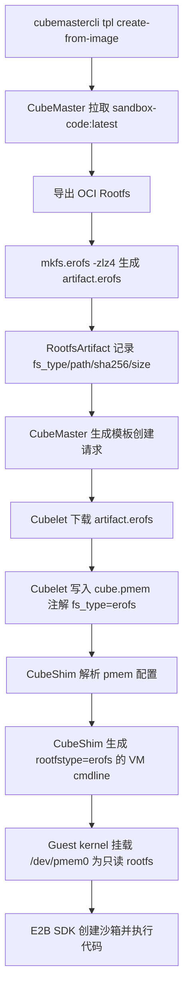
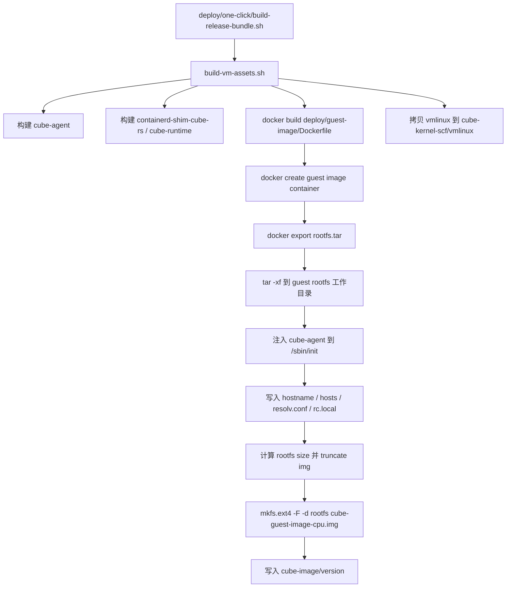

# EROFS 容器Rootfs 与 Guest OS 镜像支持设计

## 背景

Cube Sandbox 当前的模板镜像链路以 `ext4` 作为 Rootfs 与 Guest OS 镜像格式。`ext4` 对通用可写块设备很成熟，但这次 PoC 已经给出了明确收益：guest OS rootfs 从 `769M` 压到 `335M`，容器 rootfs 从 `4.7G` 压到 `2.6G`，并且两边 rootfs 都能在 guest 内正常读取。这说明 Cube Sandbox 的只读基础镜像链路切换到 EROFS 具备可行性，而且收益在当前环境里已经被量化出来。

## 目标与非目标

### 目标

- CubeMaster 支持从 OCI 镜像构建 `erofs` Rootfs artifact。
- CubeMaster、Cubelet、CubeShim 之间显式传递 artifact 文件系统类型。
- Cubelet 支持下载、缓存和注入 EROFS pmem 镜像。
- CubeShim 根据 root pmem 的 `fs_type` 生成正确的 kernel cmdline。
- 保持现有 `ext4` 默认行为和旧模板兼容。
- 提供以 `sandbox-code:latest` 为例的端到端验证路径。

### 非目标

- 不把运行时 writable layer 改成 EROFS。EROFS 仅用于只读基础 Rootfs。
- 不在第一阶段支持 EROFS 作为普通数据 volume。
- 不要求 Cloud Hypervisor 特殊识别 EROFS；CLH 只负责传递设备与 kernel cmdline，实际挂载能力由 guest kernel 决定。
- 不在第一阶段追求更高压缩率参数、分层复用或多版本镜像复用优化；相关收益留到后续评估。

## 端到端链路



## 用户故事

新增 CLI 参数建议命名为 `--rootfs-fs-type`，默认值为 `ext4`。用户创建 EROFS 模板时执行：

```bash
cubemastercli tpl create-from-image \
  --image cube-sandbox-int.tencentcloudcr.com/cube-sandbox/sandbox-code:latest \
  --rootfs-fs-type erofs \
  --writable-layer-size 1G \
  --expose-port 49999 \
  --expose-port 49983 \
  --probe 49999
```

观察构建状态：

```bash
cubemastercli tpl watch --job-id <job_id>
```

模板 READY 后，使用 README 中相同的 E2B SDK 方式创建沙箱并调用：

```bash
export E2B_API_URL="http://127.0.0.1:3000"
export E2B_API_KEY="dummy"
export CUBE_TEMPLATE_ID="<template-id>"
export SSL_CERT_FILE="/root/.local/share/mkcert/rootCA.pem"
```

```python
import os
from e2b_code_interpreter import Sandbox

with Sandbox.create(template=os.environ["CUBE_TEMPLATE_ID"]) as sandbox:
    result = sandbox.run_code("print('Hello from Cube Sandbox on EROFS!')")
    print(result)
```

## Guest OS Rootfs 制作流程

Cube Sandbox 里需要区分两类 rootfs：

- **Guest OS rootfs**：MicroVM 自身的根文件系统，启动时作为 `/dev/pmem0` 挂载，默认产物是 `cube-image/cube-guest-image-cpu.img`。
- **Sandbox image Rootfs**：由用户 OCI 镜像，例如 `sandbox-code:latest`，转换出的只读业务 rootfs artifact，运行时通过 pmem/overlay 提供给容器工作负载。

本设计需要两条链路都支持 EROFS。上一节的 `create-from-image` 主要描述 Sandbox image Rootfs；Guest OS rootfs 的现有制作链路在 `deploy/one-click/build-vm-assets.sh`。

### 现有 Guest OS 制作链路

当前 one-click runtime layout 的构建流程如下：



关键产物：

| 产物 | 当前路径 | 说明 |
|------|----------|------|
| Guest OS image | `runtime-layout/cube-image/cube-guest-image-cpu.img` | MicroVM `/dev/pmem0` rootfs |
| Guest OS version | `runtime-layout/cube-image/version` | Cubelet 分发和刷新 companion file 使用 |
| Guest kernel | `runtime-layout/cube-kernel-scf/vmlinux` | CubeShim 启动 VM 使用 |
| CubeShim runtime | `runtime-layout/cube-shim/bin/*` | containerd shim 与 `cube-runtime` |

`deploy/guest-image/Dockerfile` 当前基于 `tencentos4-minimal`，安装基础工具；`build-vm-assets.sh` 再把 `cube-agent` 连同动态库依赖复制进 guest rootfs，并把它放到 `/sbin/init`。因此 Guest OS 的 init 不是基础镜像自带 init，而是 Cube agent。

### Guest OS EROFS 制作设计

Guest OS image 增加构建参数：

```bash
ONE_CLICK_GUEST_ROOTFS_FS_TYPE=erofs
```

默认值保持 `ext4`。产物命名建议：

| fs type | 产物路径 |
|---------|----------|
| `ext4` | `cube-image/cube-guest-image-cpu.img` |
| `erofs` | `cube-image/cube-guest-image-erofs-cpu.img` |

如果为了减少安装脚本和 Cubelet/CubeShim 改动，也可以保持文件名仍为 `cube-guest-image-cpu.img`，但必须额外写入 `cube-image/fs_type` 或等价 metadata，避免靠后缀判断格式。推荐显式 metadata，不推荐只靠文件名。

构建函数从现有 ext4 专用流程：

```bash
truncate -s "${image_size_bytes}" "${output_img}"
mkfs.ext4 -F -d "${GUEST_ROOTFS_DIR}" "${output_img}"
```

改为按 fs type 分支：

```bash
case "${GUEST_ROOTFS_FS_TYPE}" in
  ext4)
    truncate -s "${image_size_bytes}" "${output_img}"
    mkfs.ext4 -F -d "${GUEST_ROOTFS_DIR}" "${output_img}"
    ;;
  erofs)
    mkfs.erofs -zlz4 "${output_img}" "${GUEST_ROOTFS_DIR}"
    ;;
esac
```

EROFS 是只读压缩镜像，不需要 `truncate` 预分配空间，也不需要按 256MiB 步进扩容。`calculate_guest_image_size_bytes` 只保留给 ext4 分支。

### Guest OS runtime layout metadata

为了让 Cubelet 和 CubeShim 知道 `/dev/pmem0` 的真实格式，runtime layout 新增：

```text
cube-image/fs_type
```

内容为：

```text
ext4
```

或：

```text
erofs
```

`build-vm-assets.sh` 在写入 `cube-image/version` 时同步写入 `cube-image/fs_type`。release bundle 把整个 `cube-image` 目录打包，因此该 metadata 会跟随安装包分发。

### Cubelet 加载 Guest OS fs type

Cubelet 当前会把 shared guest image 刷新到 per-artifact 目录，并默认认为 root image 是 ext4。改造后：

1. 读取 shared `cube-image/fs_type`。
2. 没有该文件时默认 `ext4`，兼容旧安装包。
3. 刷新 per-artifact runtime files 时同时复制 `version` 和 `fs_type`。
4. 生成 root pmem 配置时，把 guest root pmem 的 `fs_type` 写成 shared metadata 中的值。

示例 root pmem 配置：

```json
{
  "file": "/usr/local/services/cubetoolbox/cube-image/cube-guest-image-cpu.erofs",
  "discard_writes": true,
  "source_dir": "/",
  "fs_type": "erofs",
  "id": "root"
}
```

如果继续使用 `.img` 文件名，则 `file` 可以仍是 `cube-guest-image-cpu.img`，但 `fs_type` 必须来自 metadata。

### CubeShim 启动 Guest OS

CubeShim 默认 root device 是 `/dev/pmem0`。Guest OS 切到 EROFS 后，CubeShim 对 root pmem 使用：

```text
root=/dev/pmem0 rootfstype=erofs ro
```

ext4 继续使用：

```text
root=/dev/pmem0 rootflags=dax,errors=remount-ro ro rootfstype=ext4
```

这里的 `rootfstype` 是 Linux guest kernel 参数，不是 Cloud Hypervisor 特性。Cloud Hypervisor 只传入 pmem 设备和 cmdline；真正能否挂载取决于 guest kernel 是否内建 EROFS/LZ4。

### Guest OS 验证

构建 EROFS Guest OS runtime layout：

```bash
ONE_CLICK_GUEST_ROOTFS_FS_TYPE=erofs \
deploy/one-click/build-vm-assets.sh
```

检查本地产物：

```bash
cat deploy/one-click/.work/runtime-layout/cube-image/fs_type
ls -lh deploy/one-click/.work/runtime-layout/cube-image/
```

预期：

- `fs_type` 内容为 `erofs`。
- guest image 文件存在。
- `cube-kernel-scf/vmlinux` 存在。

启动沙箱后在 guest 内检查：

```bash
findmnt / -o SOURCE,FSTYPE,OPTIONS --noheadings
cat /proc/cmdline
```

预期：

- `/` 的 `FSTYPE` 为 `erofs`。
- `/proc/cmdline` 包含 `rootfstype=erofs`。
- `/sbin/init` 实际为注入后的 `cube-agent`。

## 数据模型与协议变更

### ImageStorageMediaType

在 CubeMaster 与 Cubelet 的 images proto 中增加 `erofs`：

```proto
enum ImageStorageMediaType {
  docker = 0;
  ext4 = 1;
  erofs = 2; // [NEW]
}
```

`ImageSpec.storage_media` 继续使用字符串承载，合法值变为 `docker`、`ext4`、`erofs`。没有传值时沿用当前 docker/registry pull 逻辑；旧模板中没有 fs type 时按 `ext4` 处理。

### Artifact 元数据

现有 `RootfsArtifact` 字段以 `Ext4Path`、`Ext4SHA256`、`Ext4SizeBytes` 命名。为支持多格式，新增通用字段：

| 字段 | 类型 | 说明 |
|------|------|------|
| `fs_type` | string | `ext4` 或 `erofs`，旧数据为空时视为 `ext4` [NEW] |
| `artifact_path` | string | 本地 artifact 路径，例如 `rfs-xxx.erofs` [NEW] |
| `artifact_sha256` | string | artifact SHA256 [NEW] |
| `artifact_size_bytes` | int64 | artifact 文件大小 [NEW] |

保留旧 `ext4_*` 字段，读路径优先使用通用字段，通用字段为空时回退到旧字段。写路径在 `fs_type=ext4` 时可以同时回填旧字段，降低兼容风险。

### 注解

新增或明确以下注解：

| 注解 | 说明 |
|------|------|
| `cube.master.rootfs.artifact.id` | artifact id |
| `cube.master.rootfs.artifact.url` | artifact 下载 URL |
| `cube.master.rootfs.artifact.sha256` | artifact SHA256 |
| `cube.master.rootfs.artifact.size_bytes` | artifact 文件大小 |
| `cube.master.rootfs.artifact.fs_type` | `ext4` 或 `erofs` [NEW] |
| `cube.master.rootfs.writable_layer_size` | writable layer 大小 |

Cubelet 优先读取 `cube.master.rootfs.artifact.fs_type`；缺失时回退到 `ImageSpec.storage_media`；仍缺失时回退 `ext4`。

## CubeMaster 改造

### CLI 与 API

`cubemastercli tpl create-from-image` 新增：

```bash
--rootfs-fs-type ext4|erofs
```

服务端 `CreateTemplateFromImageReq` 增加 `RootfsFsType string`，默认 `ext4`。服务端需要校验：

- 空值：设为 `ext4`
- 合法值：`ext4`、`erofs`
- 其他值：返回参数错误

模板 fingerprint 需要包含 `RootfsFsType`，避免同一 OCI 镜像和 writable layer 参数下，ext4 artifact 与 erofs artifact 错误复用。

### 构建流程

当前流程是：

1. 拉取 OCI image。
2. 导出 Rootfs 到临时目录。
3. 通过 `mkfs.ext4 -F -d <rootfsDir> <artifact.ext4>` 生成 artifact。
4. 写入 artifact 元数据。
5. 生成模板创建请求并分发。

改造后抽象为：

```go
func createRootfsImage(ctx context.Context, fsType, rootfsDir, imagePath string) error
```

`ext4` 分支保持当前逻辑：

```bash
truncate -s <size> artifact.ext4
mkfs.ext4 -F -d <rootfsDir> artifact.ext4
```

`erofs` 分支使用：

```bash
mkfs.erofs -zlz4 artifact.erofs <rootfsDir>
```

EROFS artifact 是只读压缩镜像，不需要为 writable layer 预留空间，也不需要 `truncate` 到 2 的幂 GiB。writable layer 仍由 Cube Sandbox 的现有 emptyDir/rootfs overlay 逻辑提供。

### Preflight

构建前置检查按 fs type 分支：

- `ext4`：检查 `docker`、`mkfs.ext4`、`tar`、`truncate`、`cp`，并确认 `mkfs.ext4` 支持 `-d`。
- `erofs`：检查 `docker`、`mkfs.erofs`、`tar`、`cp`，并确认 `mkfs.erofs` 支持 LZ4 压缩参数。

如果宿主机没有 `mkfs.erofs`，错误信息需要明确提示安装 `erofs-utils`。

### 下载与分发请求

`generateTemplateCreateRequest` 和 `distributeRootfsArtifact` 不再固定：

```go
StorageMedia: imagev1.ImageStorageMediaType_ext4.String()
```

而是使用 artifact 的 `fs_type`。生成的容器镜像字段示例：

```json
{
  "image": "rfs-xxxxxxxx",
  "storage_media": "erofs",
  "writable_layer_size": "1G",
  "annotations": {
    "cube.master.rootfs.artifact.id": "rfs-xxxxxxxx",
    "cube.master.rootfs.artifact.url": "http://<master>/cube/rootfs-artifact?...",
    "cube.master.rootfs.artifact.sha256": "<sha256>",
    "cube.master.rootfs.artifact.size_bytes": "<size>",
    "cube.master.rootfs.artifact.fs_type": "erofs"
  }
}
```

## Cubelet 改造

### 本地缓存路径

当前 pmem image 路径固定为：

```text
<base>/<instance_type>_os_image/<artifact_id>/<artifact_id>.ext4
```

改造为：

```text
<base>/<instance_type>_os_image/<artifact_id>/<artifact_id>.<fs_type>
```

建议新增：

```go
func GetRawImageFilePath(instanceType, imageID, fsType string) string
```

旧签名可以保留为 ext4 wrapper，降低一次性改动范围。

### 镜像确保逻辑

`EnsureImage` 识别 `storage_media=ext4|erofs` 时，都走 artifact 下载路径，不进入 registry pull。下载完成后校验 SHA256。错误信息中要包含 fs type 和 artifact id，方便定位混用 ext4/erofs 的问题。

### 分发处理

模板分发时：

- `defaultTemplateImageSpec` 保留 `StorageMedia`。
- `ensureDistributedTemplateImage` 同时接受 `ext4` 和 `erofs`。
- `materializeDistributedTemplateRuntimeFiles` 对两者都刷新 kernel 和 version companion files。

### pmem 注解

Cubelet 生成 `cube.pmem` 时要写入真实 `FsType`：

```json
[
  {
    "file": "/data/.../rfs-xxx/rfs-xxx.erofs",
    "discard_writes": true,
    "source_dir": "/",
    "fs_type": "erofs",
    "size": 524288000,
    "id": "cube-container-pmem-0"
  }
]
```

现有 volume pmem 仍可保持 `ext4`，因为本设计只覆盖 Rootfs 与 Guest OS 镜像。

## CubeShim 改造

CubeShim 已经能从 `cube.pmem` 注解解析 `fs_type`。需要改的是 VM root cmdline。

当前默认值类似：

```text
root=/dev/pmem0 rootflags=dax,errors=remount-ro ro rootfstype=ext4
```

改造后：

- 默认仍为 ext4，兼容旧行为。
- 当 root pmem 的 `fs_type=erofs` 时，替换为：

```text
root=/dev/pmem0 rootfstype=erofs ro
```

`errors=remount-ro` 是 ext4 语义，不能用于 EROFS。`dax` 是否可用取决于 guest kernel 与 EROFS 特性组合，第一阶段不默认启用。压缩 EROFS 与 DAX 的组合尤其需要独立验证。

Cloud Hypervisor 不需要识别 EROFS。它只传入 pmem 设备和 kernel cmdline；是否能挂载由 guest kernel 决定。

## Guest Kernel 要求

如果 Cube Sandbox 的 guest root 没有 initramfs，EROFS 必须编进 kernel，而不能只作为 module：

```text
CONFIG_EROFS_FS=y
CONFIG_EROFS_FS_ZIP=y
CONFIG_EROFS_FS_ZIP_LZ4=y
```

实际配置项名称可能随 kernel 版本不同略有差异，实施前应以当前 `configs/kernel-*.config` 和构建 kernel 版本为准。端到端验证失败时，优先检查 guest kernel 是否支持 EROFS 与 LZ4。

## 端到端验证

### 构建 EROFS 模板

```bash
cubemastercli tpl create-from-image \
  --image cube-sandbox-int.tencentcloudcr.com/cube-sandbox/sandbox-code:latest \
  --rootfs-fs-type erofs \
  --writable-layer-size 1G \
  --expose-port 49999 \
  --expose-port 49983 \
  --probe 49999
```

```bash
cubemastercli tpl watch --job-id <job_id>
```

预期：

- job 进入 `READY`。
- artifact 信息显示 `fs_type=erofs`。
- artifact 文件后缀为 `.erofs`。
- `storage_media=erofs` 出现在模板创建请求中。

### 检查模板请求

```bash
cubemastercli tpl info --template-id <template-id> --json --include-request
```

重点检查：

```json
{
  "storage_media": "erofs",
  "annotations": {
    "cube.master.rootfs.artifact.fs_type": "erofs"
  }
}
```

### 启动沙箱并执行代码

```bash
export E2B_API_URL="http://127.0.0.1:3000"
export E2B_API_KEY="dummy"
export CUBE_TEMPLATE_ID="<template-id>"
export SSL_CERT_FILE="/root/.local/share/mkcert/rootCA.pem"
```

```python
import os
from e2b_code_interpreter import Sandbox

with Sandbox.create(template=os.environ["CUBE_TEMPLATE_ID"]) as sandbox:
    print(sandbox.run_code("import os; print(os.uname().sysname)"))
    print(sandbox.commands.run("findmnt / -o SOURCE,FSTYPE,OPTIONS --noheadings").stdout)
```

预期：

- Python 代码正常执行。
- `findmnt /` 输出的 `FSTYPE` 为 `erofs`。
- writable layer 仍可写，例如：

```python
with Sandbox.create(template=os.environ["CUBE_TEMPLATE_ID"]) as sandbox:
    print(sandbox.commands.run("echo ok > /tmp/erofs-check && cat /tmp/erofs-check").stdout)
```

### 回归 ext4

不传 `--rootfs-fs-type` 时执行 README 原命令：

```bash
cubemastercli tpl create-from-image \
  --image cube-sandbox-int.tencentcloudcr.com/cube-sandbox/sandbox-code:latest \
  --writable-layer-size 1G \
  --expose-port 49999 \
  --expose-port 49983 \
  --probe 49999
```

预期保持 `storage_media=ext4`，旧路径和旧模板不受影响。

## 测试计划

### CubeMaster 单测

- `rootfs_fs_type` 默认值为 `ext4`。
- 非法 `rootfs_fs_type` 被拒绝。
- fingerprint 包含 fs type，ext4 与 erofs 不复用同一个 artifact id。
- `createRootfsImage(ext4)` 调用 `mkfs.ext4`。
- `createRootfsImage(erofs)` 调用 `mkfs.erofs -zlz4`。
- `generateTemplateCreateRequest` 对 erofs 写入 `storage_media=erofs` 与 `artifact.fs_type=erofs`。
- 旧 `RootfsArtifact` 没有 `fs_type` 时按 ext4 读取。

### Cubelet 单测

- `storage_media=erofs` 走 pmem artifact 下载，不走 registry pull。
- 本地路径使用 `.erofs` 后缀。
- SHA256 校验失败时返回包含 artifact id 和 fs type 的错误。
- `cube.pmem` 注解中 `fs_type=erofs`。
- ext4 旧路径仍兼容。

### CubeShim 单测

- 默认 cmdline 仍包含 `rootfstype=ext4`。
- root pmem `fs_type=erofs` 时 cmdline 包含 `rootfstype=erofs`。
- EROFS cmdline 不包含 `errors=remount-ro`。
- 用户额外传入冲突的 `rootfstype` 时仍被拒绝。

### 集成测试

- 使用 `sandbox-code:latest` 构建 EROFS 模板。
- 创建沙箱，运行 Python 代码。
- 在 guest 内执行 `findmnt /` 验证 root fs。
- 创建和读取 `/tmp` 文件，验证 writable layer。
- 并发创建 N 个沙箱，记录成功率、平均启动时间、P95 启动时间。
- 对比 ext4 与 erofs artifact 文件大小。

## 风险与处理

| 风险 | 影响 | 处理 |
|------|------|------|
| guest kernel 未内建 EROFS | VM 无法挂载 rootfs | 在 preflight 或文档中明确 kernel 配置；端到端前先检查 config |
| `mkfs.erofs` 不存在 | Master 构建失败 | preflight 明确提示安装 `erofs-utils` |
| ext4 与 erofs artifact 误复用 | 启动失败或 checksum 不一致 | fingerprint 纳入 fs type |
| EROFS rootflags 不兼容 | kernel mount 失败 | EROFS 第一阶段只传 `rootfstype=erofs ro` |
| 旧 DB 表无新字段 | 读取失败或字段为空 | 增量迁移；读路径兼容旧 `ext4_*` 字段 |
| CLI/文档默认值变化造成误解 | 用户不确定当前格式 | 默认仍为 ext4，只有显式传参才使用 erofs |

## PR 拆分建议

1. **协议与兼容层**
   - proto 增加 `erofs`
   - 增加 fs type 注解与通用 artifact 字段
   - DB migration 与旧字段兼容

2. **CubeShim 与 Cubelet 动态 fs type**
   - Cubelet 本地路径和 pmem 注解支持动态 fs type
   - CubeShim 根据 root pmem 生成 `rootfstype`
   - ext4 回归测试

3. **CubeMaster EROFS 构建**
   - `--rootfs-fs-type erofs`
   - `mkfs.erofs -zlz4`
   - artifact metadata、下载、分发请求写入 erofs

4. **端到端验证与文档**
   - 使用 `sandbox-code:latest` 跑通模板构建、分发、启动、SDK 执行
   - 补充大小和启动性能对比数据

## 完成标准

- README 原 ext4 示例无需改动即可继续成功。
- 新增 `--rootfs-fs-type erofs` 后，`sandbox-code:latest` 能构建出 READY 模板。
- Cubelet 节点缓存中存在 `.erofs` artifact。
- `cube.pmem` 注解包含 `fs_type=erofs`。
- CubeShim VM cmdline 包含 `rootfstype=erofs`。
- guest 内 `findmnt /` 显示 `erofs`。
- E2B SDK 能创建沙箱并执行 Python 代码。
