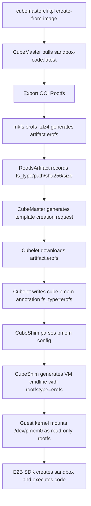
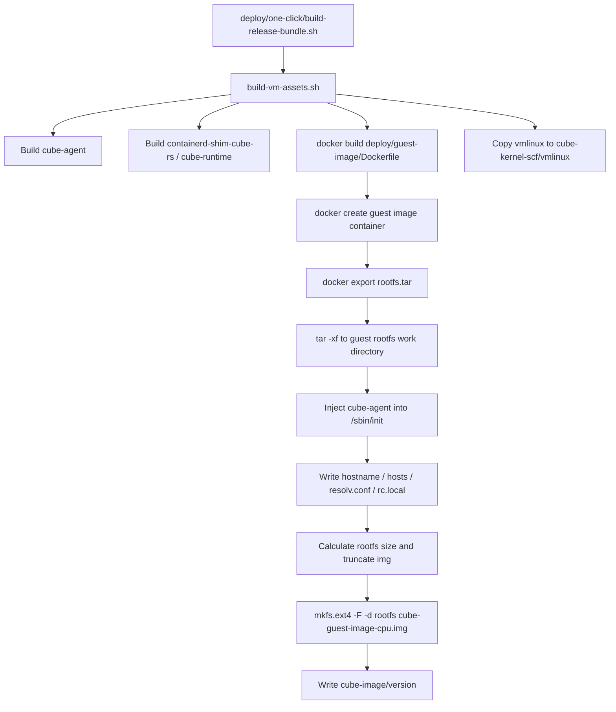

# EROFS Rootfs and Guest OS Image Support Design

## Background

The current template image pipeline in Cube Sandbox uses `ext4` as the format for both Rootfs and Guest OS images. While `ext4` is mature for general-purpose writable block devices, the latest PoC has already shown clear gains: the guest OS rootfs was reduced from `769M` to `335M`, the container rootfs from `4.7G` to `2.6G`, and both rootfs images could be read successfully inside the guest. This demonstrates that Cube Sandbox's read-only base-image pipeline can move to EROFS with measurable benefits in the current environment.

## Goals and Non-Goals

### Goals

- Support building `erofs` Rootfs artifacts from OCI images in CubeMaster.
- Explicitly pass artifact file system types between CubeMaster, Cubelet, and CubeShim.
- Support downloading, caching, and injecting EROFS pmem images in Cubelet.
- Generate correct kernel cmdlines in CubeShim based on the root pmem's `fs_type`.
- Maintain compatibility with existing `ext4` default behavior and old templates.
- Provide an end-to-end validation path using `sandbox-code:latest`.

### Non-Goals

- Changing the runtime writable layer to EROFS. EROFS is only used for the read-only base Rootfs.
- Supporting EROFS as a general data volume in the first phase.
- Requiring Cloud Hypervisor to specifically recognize EROFS; CLH only passes the device and kernel cmdline, with actual mounting capability determined by the guest kernel.
- Not optimizing for higher compression ratios, layered reuse, or multi-version image reuse in the first phase; those gains are deferred for later evaluation.
- Not turning the current PoC into an end-to-end capability commitment; this phase only validates dual EROFS pmem mounting.

## End-to-End Pipeline



## User Stories

The proposed name for the new CLI parameter is `--rootfs-fs-type`, with a default value of `ext4`. To create an EROFS template:

```bash
cubemastercli tpl create-from-image \
  --image cube-sandbox-int.tencentcloudcr.com/cube-sandbox/sandbox-code:latest \
  --rootfs-fs-type erofs \
  --writable-layer-size 1G \
  --expose-port 49999 \
  --expose-port 49983 \
  --probe 49999
```

Watch build status:

```bash
cubemastercli tpl watch --job-id <job_id>
```

After the template is READY, create and call the sandbox using the same E2B SDK method as in the README:

```bash
export E2B_API_URL="http://127.0.0.1:3000"
export E2B_API_KEY="dummy"
export CUBE_TEMPLATE_ID="<template-id>"
export SSL_CERT_FILE="/root/.local/share/mkcert/rootCA.pem"
```

```python
import os
from e2b_code_interpreter import Sandbox

with Sandbox.create(template=os.environ["CUBE_TEMPLATE_ID"]) as sandbox:
    result = sandbox.run_code("print('Hello from Cube Sandbox on EROFS!')")
    print(result)
```

## Guest OS Rootfs Production Process

Two types of rootfs need to be distinguished in Cube Sandbox:

- **Guest OS rootfs**: The root file system of the MicroVM itself, mounted as `/dev/pmem0` at boot. The default output is `cube-image/cube-guest-image-cpu.img`.
- **Sandbox image Rootfs**: The read-only business rootfs artifact converted from user OCI images (e.g., `sandbox-code:latest`), provided to container workloads via pmem/overlay at runtime.

This design requires EROFS support for both pipelines. The previous `create-from-image` section describes the Sandbox image Rootfs; the existing production pipeline for the Guest OS rootfs is in `deploy/one-click/build-vm-assets.sh`.

### Existing Guest OS Production Pipeline

The current one-click runtime layout build process is as follows:



Key Artifacts:

| Artifact | Current Path | Description |
|----------|--------------|-------------|
| Guest OS image | `runtime-layout/cube-image/cube-guest-image-cpu.img` | MicroVM `/dev/pmem0` rootfs |
| Guest OS version | `runtime-layout/cube-image/version` | Used for distribution and refreshing companion files in Cubelet |
| Guest kernel | `runtime-layout/cube-kernel-scf/vmlinux` | Used by CubeShim to boot the VM |
| CubeShim runtime | `runtime-layout/cube-shim/bin/*` | containerd shim and `cube-runtime` |

`deploy/guest-image/Dockerfile` is currently based on `tencentos4-minimal` and installs basic tools; `build-vm-assets.sh` then copies `cube-agent` along with its dynamic library dependencies into the guest rootfs and places it at `/sbin/init`. Thus, the Guest OS init is Cube agent, not the base image's default init.

### Guest OS EROFS Production Design

Add a build parameter for the Guest OS image:

```bash
ONE_CLICK_GUEST_ROOTFS_FS_TYPE=erofs
```

The default value remains `ext4`. Proposed output naming:

| fs type | Artifact Path |
|---------|---------------|
| `ext4` | `cube-image/cube-guest-image-cpu.img` |
| `erofs` | `cube-image/cube-guest-image-erofs-cpu.img` |

To minimize changes to installation scripts and Cubelet/CubeShim, the filename can remain `cube-guest-image-cpu.img`, but `cube-image/fs_type` or equivalent metadata must be explicitly written to avoid relying on suffixes. Explicit metadata is recommended over filenames only.

The build function changes from the current ext4-specific process:

```bash
truncate -s "${image_size_bytes}" "${output_img}"
mkfs.ext4 -F -d "${GUEST_ROOTFS_DIR}" "${output_img}"
```

To a branch-based process by fs type:

```bash
case "${GUEST_ROOTFS_FS_TYPE}" in
  ext4)
    truncate -s "${image_size_bytes}" "${output_img}"
    mkfs.ext4 -F -d "${GUEST_ROOTFS_DIR}" "${output_img}"
    ;;
  erofs)
    mkfs.erofs -zlz4 "${output_img}" "${GUEST_ROOTFS_DIR}"
    ;;
esac
```

EROFS is a read-only compressed image and does not require `truncate` for space pre-allocation, nor does it need expansion in 256MiB increments. `calculate_guest_image_size_bytes` is reserved only for the ext4 branch.

### Guest OS Runtime Layout Metadata

To let Cubelet and CubeShim know the actual format of `/dev/pmem0`, the following is added to the runtime layout:

```text
cube-image/fs_type
```

Content:

```text
ext4
```

or:

```text
erofs
```

`build-vm-assets.sh` writes `cube-image/fs_type` simultaneously with `cube-image/version`. The release bundle packs the entire `cube-image` directory, so this metadata follows the installation package distribution.

### Loading Guest OS fs type in Cubelet

Cubelet currently refreshes the shared guest image to the per-artifact directory and assumes the root image is ext4 by default. After the refactoring:

1. Read shared `cube-image/fs_type`.
2. Default to `ext4` if the file is missing for backward compatibility.
3. Simultaneously copy `version` and `fs_type` when refreshing per-artifact runtime files.
4. When generating the root pmem config, write the guest root pmem's `fs_type` as the value from shared metadata.

Example root pmem configuration:

```json
{
  "file": "/usr/local/services/cubetoolbox/cube-image/cube-guest-image-cpu.erofs",
  "discard_writes": true,
  "source_dir": "/",
  "fs_type": "erofs",
  "id": "root"
}
```

If the `.img` filename is still used, `file` can still be `cube-guest-image-cpu.img`, but `fs_type` must come from metadata.

### Booting Guest OS in CubeShim

CubeShim defaults the root device to `/dev/pmem0`. After switching Guest OS to EROFS, CubeShim uses for the root pmem:

```text
root=/dev/pmem0 rootfstype=erofs ro
```

`ext4` continues to use:

```text
root=/dev/pmem0 rootflags=dax,errors=remount-ro ro rootfstype=ext4
```

Here, `rootfstype` is a Linux guest kernel parameter, not a Cloud Hypervisor feature. Cloud Hypervisor only passes the pmem device and cmdline; the actual mounting capability depends on whether the guest kernel has EROFS/LZ4 built-in.

### Guest OS Validation

Build the EROFS Guest OS runtime layout:

```bash
ONE_CLICK_GUEST_ROOTFS_FS_TYPE=erofs \
deploy/one-click/build-vm-assets.sh
```

Check local artifacts:

```bash
cat deploy/one-click/.work/runtime-layout/cube-image/fs_type
ls -lh deploy/one-click/.work/runtime-layout/cube-image/
```

Expected:

- `fs_type` content is `erofs`.
- Guest image file exists.
- `cube-kernel-scf/vmlinux` exists.

Check inside the guest after sandbox startup:

```bash
findmnt / -o SOURCE,FSTYPE,OPTIONS --noheadings
cat /proc/cmdline
```

Expected:

- `FSTYPE` of `/` is `erofs`.
- `/proc/cmdline` contains `rootfstype=erofs`.
- `/sbin/init` is actually the injected `cube-agent`.

## Data Model and Protocol Changes

### ImageStorageMediaType

Add `erofs` to the images proto for CubeMaster and Cubelet:

```proto
enum ImageStorageMediaType {
  docker = 0;
  ext4 = 1;
  erofs = 2; // [NEW]
}
```

`ImageSpec.storage_media` continues to use a string carrier, with valid values becoming `docker`, `ext4`, `erofs`. If no value is passed, the current docker/registry pull logic is used; if fs type is missing in old templates, it is treated as `ext4`.

### Artifact Metadata

Existing `RootfsArtifact` fields are named `Ext4Path`, `Ext4SHA256`, `Ext4SizeBytes`. To support multiple formats, new generic fields are added:

| Field | Type | Description |
|-------|------|-------------|
| `fs_type` | string | `ext4` or `erofs`, treated as `ext4` if old data is empty [NEW] |
| `artifact_path` | string | Local artifact path, e.g., `rfs-xxx.erofs` [NEW] |
| `artifact_sha256` | string | artifact SHA256 [NEW] |
| `artifact_size_bytes` | int64 | artifact file size [NEW] |

Keep old `ext4_*` fields. The read path prioritizes generic fields and falls back to old fields if empty. The write path can backfill old fields when `fs_type=ext4` to reduce compatibility risks.

### Annotations

New or clarified annotations:

| Annotation | Description |
|------------|-------------|
| `cube.master.rootfs.artifact.id` | artifact id |
| `cube.master.rootfs.artifact.url` | artifact download URL |
| `cube.master.rootfs.artifact.sha256` | artifact SHA256 |
| `cube.master.rootfs.artifact.size_bytes` | artifact file size |
| `cube.master.rootfs.artifact.fs_type` | `ext4` or `erofs` [NEW] |
| `cube.master.rootfs.writable_layer_size` | writable layer size |

Cubelet prioritizes reading `cube.master.rootfs.artifact.fs_type`; falls back to `ImageSpec.storage_media` if missing; and further falls back to `ext4`.

## CubeMaster Refactoring

### CLI and API

New `cubemastercli tpl create-from-image` additions:

```bash
--rootfs-fs-type ext4|erofs
```

Server-side `CreateTemplateFromImageReq` adds `RootfsFsType string`, default `ext4`. Validation required:

- Empty: set to `ext4`
- Valid: `ext4`, `erofs`
- Other: return parameter error

The template fingerprint must include `RootfsFsType` to prevent incorrect reuse of ext4 and erofs artifacts under the same OCI image and writable layer parameters.

### Build Process

Current process:

1. Pull OCI image.
2. Export Rootfs to temporary directory.
3. Generate artifact via `mkfs.ext4 -F -d <rootfsDir> <artifact.ext4>`.
4. Write artifact metadata.
5. Generate template creation request and distribute.

Refactored abstraction:

```go
func createRootfsImage(ctx context.Context, fsType, rootfsDir, imagePath string) error
```

`ext4` branch maintains current logic:

```bash
truncate -s <size> artifact.ext4
mkfs.ext4 -F -d <rootfsDir> artifact.ext4
```

`erofs` branch uses:

```bash
mkfs.erofs -zlz4 artifact.erofs <rootfsDir>
```

EROFS artifacts are read-only compressed images and do not require space pre-allocation for the writable layer, nor do they need `truncate` to 2^n GiB. The writable layer is still provided by Cube Sandbox's existing emptyDir/rootfs overlay logic.

### Preflight

Build pre-checks branched by fs type:

- `ext4`: Check `docker`, `mkfs.ext4`, `tar`, `truncate`, `cp`, and confirm `mkfs.ext4` supports `-d`.
- `erofs`: Check `docker`, `mkfs.erofs`, `tar`, `cp`, and confirm `mkfs.erofs` supports LZ4 compression parameters.

If `mkfs.erofs` is missing, the error message should explicitly prompt to install `erofs-utils`.

### Download and Distribution Request

`generateTemplateCreateRequest` and `distributeRootfsArtifact` no longer fixed to:

```go
StorageMedia: imagev1.ImageStorageMediaType_ext4.String()
```

Instead, they use the artifact's `fs_type`. Example container image field:

```json
{
  "image": "rfs-xxxxxxxx",
  "storage_media": "erofs",
  "writable_layer_size": "1G",
  "annotations": {
    "cube.master.rootfs.artifact.id": "rfs-xxxxxxxx",
    "cube.master.rootfs.artifact.url": "http://<master>/cube/rootfs-artifact?...",
    "cube.master.rootfs.artifact.sha256": "<sha256>",
    "cube.master.rootfs.artifact.size_bytes": "<size>",
    "cube.master.rootfs.artifact.fs_type": "erofs"
  }
}
```

## Cubelet Refactoring

### Local Cache Path

Current pmem image path fixed at:

```text
<base>/<instance_type>_os_image/<artifact_id>/<artifact_id>.ext4
```

Refactored to:

```text
<base>/<instance_type>_os_image/<artifact_id>/<artifact_id>.<fs_type>
```

Proposed new function:

```go
func GetRawImageFilePath(instanceType, imageID, fsType string) string
```

The old signature can be kept as an ext4 wrapper to limit the initial change scope.

### Image Assurance Logic

When `EnsureImage` recognizes `storage_media=ext4|erofs`, it follows the artifact download path instead of registry pull. SHA256 is verified after download. Error messages should include fs type and artifact id to facilitate troubleshooting.

### Distribution Handling

During template distribution:

- `defaultTemplateImageSpec` keeps `StorageMedia`.
- `ensureDistributedTemplateImage` accepts both `ext4` and `erofs`.
- `materializeDistributedTemplateRuntimeFiles` refreshes kernel and version companion files for both.

### pmem Annotation

Cubelet must write the actual `FsType` when generating `cube.pmem`:

```json
[
  {
    "file": "/data/.../rfs-xxx/rfs-xxx.erofs",
    "discard_writes": true,
    "source_dir": "/",
    "fs_type": "erofs",
    "size": 524288000,
    "id": "cube-container-pmem-0"
  }
]
```

Existing volume pmem can remain `ext4`, as this design only covers Rootfs and Guest OS images.

## CubeShim Refactoring

CubeShim can already parse `fs_type` from the `cube.pmem` annotation. The change is in the VM root cmdline.

Current default:

```text
root=/dev/pmem0 rootflags=dax,errors=remount-ro ro rootfstype=ext4
```

Refactored:

- Default remains ext4 for backward compatibility.
- When the root pmem's `fs_type=erofs`, replace with:

```text
root=/dev/pmem0 rootfstype=erofs ro
```

`errors=remount-ro` is ext4-specific and cannot be used for EROFS. `dax` availability depends on the guest kernel and EROFS feature combination; it is not enabled by default in the first phase. The combination of compressed EROFS and DAX especially needs independent validation.

Cloud Hypervisor does not need to recognize EROFS. It only passes the pmem device and kernel cmdline; mounting capability is determined by the guest kernel.

## Guest Kernel Requirements

If the guest root of Cube Sandbox has no initramfs, EROFS must be built into the kernel, not just as a module:

```text
CONFIG_EROFS_FS=y
CONFIG_EROFS_FS_ZIP=y
CONFIG_EROFS_FS_ZIP_LZ4=y
```

Actual configuration names may vary slightly with kernel versions; use current `configs/kernel-*.config` and the built kernel version as the standard before implementation. Check guest kernel support for EROFS and LZ4 first if end-to-end validation fails.

## End-to-End Validation

### Build EROFS Template

```bash
cubemastercli tpl create-from-image \
  --image cube-sandbox-int.tencentcloudcr.com/cube-sandbox/sandbox-code:latest \
  --rootfs-fs-type erofs \
  --writable-layer-size 1G \
  --expose-port 49999 \
  --expose-port 49983 \
  --probe 49999
```

```bash
cubemastercli tpl watch --job-id <job_id>
```

Expected:

- Job enters `READY`.
- Artifact info shows `fs_type=erofs`.
- Artifact file suffix is `.erofs`.
- `storage_media=erofs` appears in the template creation request.

### Check Template Request

```bash
cubemastercli tpl info --template-id <template-id> --json --include-request
```

Focus check:

```json
{
  "storage_media": "erofs",
  "annotations": {
    "cube.master.rootfs.artifact.fs_type": "erofs"
  }
}
```

### Start Sandbox and Execute Code

```bash
export E2B_API_URL="http://127.0.0.1:3000"
export E2B_API_KEY="dummy"
export CUBE_TEMPLATE_ID="<template-id>"
export SSL_CERT_FILE="/root/.local/share/mkcert/rootCA.pem"
```

```python
import os
from e2b_code_interpreter import Sandbox

with Sandbox.create(template=os.environ["CUBE_TEMPLATE_ID"]) as sandbox:
    print(sandbox.run_code("import os; print(os.uname().sysname)"))
    print(sandbox.commands.run("findmnt / -o SOURCE,FSTYPE,OPTIONS --noheadings").stdout)
```

Expected:

- Python code executes normally.
- `findmnt /` outputs `FSTYPE` as `erofs`.
- Writable layer remains writable, e.g.:

```python
with Sandbox.create(template=os.environ["CUBE_TEMPLATE_ID"]) as sandbox:
    print(sandbox.commands.run("echo ok > /tmp/erofs-check && cat /tmp/erofs-check").stdout)
```

### Regression to ext4

Execute the original README command without passing `--rootfs-fs-type`:

```bash
cubemastercli tpl create-from-image \
  --image cube-sandbox-int.tencentcloudcr.com/cube-sandbox/sandbox-code:latest \
  --writable-layer-size 1G \
  --expose-port 49999 \
  --expose-port 49983 \
  --probe 49999
```

Expected to maintain `storage_media=ext4`; old paths and old templates remain unaffected.

## Test Plan

### CubeMaster Unit Tests

- `rootfs_fs_type` defaults to `ext4`.
- Invalid `rootfs_fs_type` is rejected.
- Fingerprint includes fs type; ext4 and erofs artifacts are not reused for the same id.
- `createRootfsImage(ext4)` calls `mkfs.ext4`.
- `createRootfsImage(erofs)` calls `mkfs.erofs -zlz4`.
- `generateTemplateCreateRequest` writes `storage_media=erofs` and `artifact.fs_type=erofs` for erofs.
- Old `RootfsArtifact` without `fs_type` is read as ext4.

### Cubelet Unit Tests

- `storage_media=erofs` follows pmem artifact download, not registry pull.
- Local paths use `.erofs` suffix.
- SHA256 verification failure returns an error including artifact id and fs type.
- `cube.pmem` annotation has `fs_type=erofs`.
- ext4 old paths remain compatible.

### CubeShim Unit Tests

- Default cmdline still contains `rootfstype=ext4`.
- cmdline contains `rootfstype=erofs` when root pmem `fs_type=erofs`.
- EROFS cmdline does not contain `errors=remount-ro`.
- User-provided conflicting `rootfstype` is still rejected.

### Integration Tests

- Build EROFS template using `sandbox-code:latest`.
- Create sandbox, run Python code.
- Execute `findmnt /` in guest to verify root fs.
- Create and read `/tmp` file to verify writable layer.
- Concurrently create N sandboxes, record success rate, average startup time, and P95 startup time.
- Compare artifact file sizes between ext4 and erofs.

## Risks and Handling

| Risk | Impact | Handling |
|------|--------|----------|
| guest kernel missing EROFS | VM cannot mount rootfs | Specify kernel config in preflight or docs; check config before E2E |
| `mkfs.erofs` missing | Master build fails | Prompt to install `erofs-utils` in preflight |
| ext4 and erofs artifacts reused | Startup fails or checksum mismatch | Include fs type in fingerprint |
| EROFS rootflags incompatible | Kernel mount fails | Pass only `rootfstype=erofs ro` for EROFS in phase 1 |
| Old DB table missing new fields | Read fails or empty fields | Incremental migration; read path compatible with old `ext4_*` fields |
| CLI/docs default change confusion | User uncertain of current format | Default remains ext4; erofs only used with explicit parameters |

## PR Split Suggestions

1. **Protocol and Compatibility Layer**
   - Add `erofs` to proto
   - Add fs type annotation and generic artifact fields
   - DB migration and old field compatibility

2. **Dynamic fs type in CubeShim and Cubelet**
   - Support dynamic fs type in Cubelet local paths and pmem annotations
   - CubeShim generates `rootfstype` based on root pmem
   - ext4 regression testing

3. **CubeMaster EROFS Build**
   - `--rootfs-fs-type erofs`
   - `mkfs.erofs -zlz4`
   - artifact metadata, download, distribution request writing erofs

4. **End-to-End Validation and Documentation**
   - Successfully run template build, distribution, startup, and SDK execution with `sandbox-code:latest`
   - Supplement with size and startup performance comparison data

## Completion Criteria

- Original ext4 examples in README continue to succeed without changes.
- `sandbox-code:latest` can build a READY template after adding `--rootfs-fs-type erofs`.
- `.erofs` artifact exists in Cubelet node cache.
- `cube.pmem` annotation contains `fs_type=erofs`.
- CubeShim VM cmdline contains `rootfstype=erofs`.
- `findmnt /` inside guest shows `erofs`.
- E2B SDK can create sandboxes and execute Python code.
