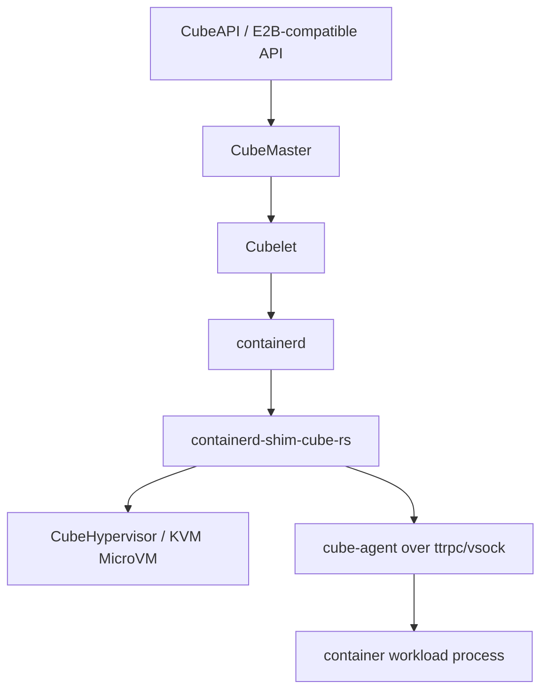
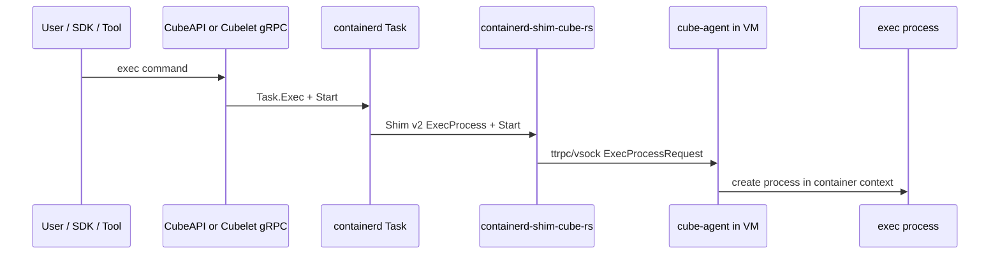
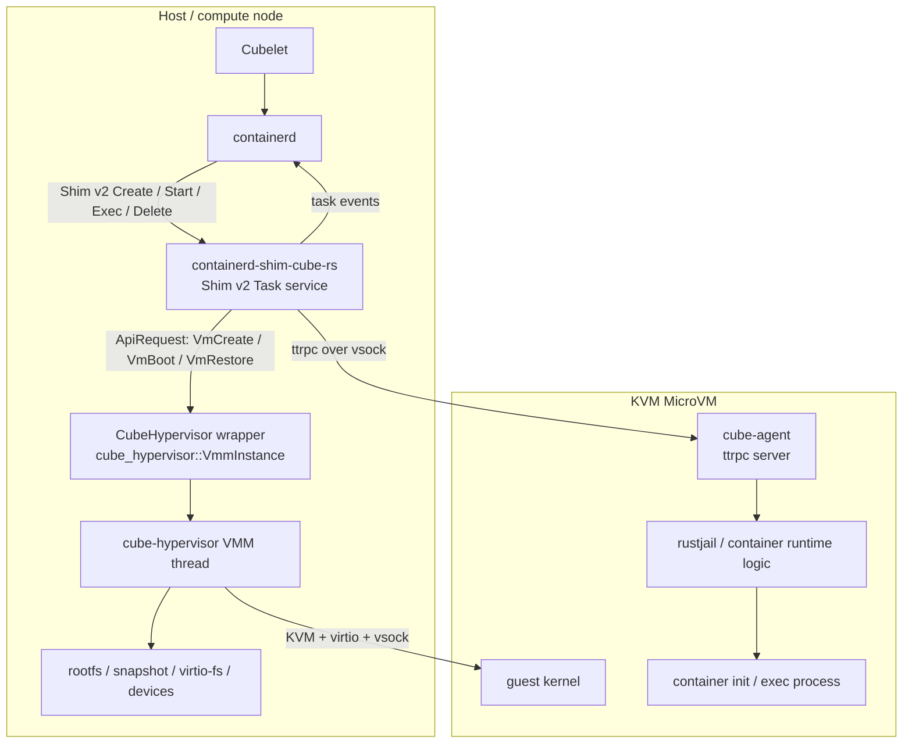
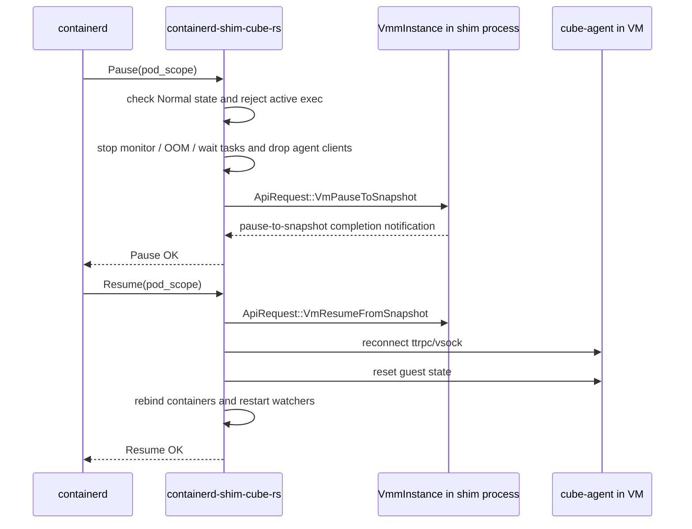

# 常见问题

本文补充 Cube Sandbox 运行时、containerd 集成、exec 路径、CubeHypervisor 定制以及 CubeShim 架构相关的常见问题。

## Cubelet 集成 containerd 的主要用途是什么？

Cubelet 是计算节点上的本地生命周期管理组件。它集成 containerd，主要不是为了把沙箱降级成普通容器，而是为了复用 containerd 已经成熟的镜像、快照、任务和 shim v2 运行时模型，把 Cube 的 MicroVM 沙箱接入标准容器运行时控制面。

核心用途包括：

- **镜像与 rootfs 管理**：复用 containerd 的 image、content、snapshotter 等能力拉取和展开 OCI 镜像，为工作负载容器准备 rootfs。
- **任务生命周期抽象**：Cubelet 通过 containerd 创建容器和 task，containerd 再按 `io.containerd.cube.rs` task runtime 启动 `containerd-shim-cube-rs`。
- **运行时解耦**：containerd 只看到标准 Task / Shim v2 语义；真正的 KVM MicroVM 创建、vsock 通信、Guest 内进程管理由 CubeShim、CubeHypervisor 和 cube-agent 完成。
- **事件与状态对齐**：CubeShim 向 containerd 发布 task create/start/exec/delete 等事件，Cubelet 可以沿用 containerd 的状态模型，同时维护 Cube 自己的沙箱元数据。
- **兼容生态工具**：底层可以使用 containerd 的 container/task/exec 模型调试或维护，外层仍通过 CubeAPI/E2B 兼容接口服务用户。

简化链路如下：

## 怎么 exec 到容器中？有对外的 API 吗？

有，但需要区分三层入口：

1. **用户推荐入口：E2B 兼容 API / SDK**

   面向业务用户时，通常通过 CubeAPI 暴露的 E2B 兼容接口执行命令，例如 E2B SDK 的 commands/code 执行能力。请求会经 CubeAPI、CubeMaster 转发到目标 Cubelet 和沙箱。

2. **Cubelet 节点级 gRPC API：`CubeboxMgr.Exec`**

   Cubelet 的节点级 gRPC API 中定义了 `ExecCubeSandboxRequest` / `ExecCubeSandboxResponse`，服务方法是 `CubeboxMgr.Exec`。请求字段包括：

   - `sandbox_id`：目标沙箱 ID
   - `container_id`：目标容器 ID
   - `terminal`：是否使用交互式终端
   - `args`：要执行的命令及参数
   - `env`：附加或覆盖环境变量
   - `cwd`：工作目录

   Cubelet 实现中会找到目标 sandbox/container/task，生成 OCI `Process` spec，然后调用 containerd task 的 `Exec` 和 `Start`。

3. **containerd / shim v2 内部路径：`Task.Exec` -> `ExecProcess`**

   如果从节点本地或内部维护工具发起 exec，路径通常是 containerd task exec。containerd 会把请求发送给 `containerd-shim-cube-rs` 的 shim v2 `ExecProcess` 实现；CubeShim 再通过 ttrpc/vsock 把 `ExecProcessRequest` 转发给 VM 内的 `cube-agent`，由 agent 在容器的 namespace/cgroup 语义下创建进程。

整体链路：

注意：当前 Cubelet 的 `Exec` 实现使用空 stdio（dummy IO），适合非交互式维护命令和控制面触发；用户交互式命令体验通常应走 CubeAPI/E2B 兼容层提供的能力。

## Cloud Hypervisor 相比官方版本做了哪些改动？能否无缝迁移？

仓库中的 `hypervisor/` 基于 Cloud Hypervisor 定制，包名和默认二进制已调整为 `cube-hypervisor`。从当前代码看，Cube 侧依赖的关键改动包括：

- **库化嵌入能力**：新增/暴露 `cube_hypervisor::VmmInstance`，CubeShim 可以在同一进程内创建 VMM 线程，并通过 `send_request(ApiRequest::...)` 直接控制 VM，而不是只通过外部 `cloud-hypervisor` 进程和 HTTP socket 管理。
- **Cube 运行时配置**：`VmmConfig` 增加 `sandbox_id`、`event_notifier`、`http_path` 等字段，用于按沙箱隔离日志、API socket 和运行时事件。
- **事件通知机制**：通过 `event_notifier::NotifyEvent` 把 `VsockServerReady`、`RestoreReady`、`VmShutdown` 等事件同步给 CubeShim，便于 shim 等待 agent 就绪、快照恢复完成或 VM 退出。
- **Cube 需要的 VMM API 扩展**：CubeShim 使用了 `VmSetFs`、`VmAddDevice`、`VmRemoveDevice` 等请求，用于运行时更新 virtio-fs 允许目录、热插/移除设备等。
- **native virtio-fs/backendfs 能力**：`FsConfig` 支持 `native=true`、`shared_dir`、`allowed_dirs`、cache、xattr、read-only 等 backendfs 配置，VMM 内部直接承载 virtio-fs backend，而不是必须依赖独立 `virtiofsd` 进程和 vhost-user socket。CubeShim 会把这些配置写入 `FsConfig.backendfs_config`，并通过 `VmSetFs` 在运行中更新可访问目录过滤。
- **日志与观测适配**：日志中携带 sandbox id，并有面向 Cube 启动耗时、VMM 事件和异步日志的适配。
- **seccomp 与启动路径适配**：CubeShim 会按自身需要补充运行时 seccomp 规则，并通过 Rust API 启动/管理 VMM。

在沙箱场景里，native virtio-fs 主要用于宿主机和 Guest 之间的高效、可控文件共享：

- **共享沙箱 rootfs / overlay 相关目录**：Guest 内的 agent/container runtime 可以通过 virtio-fs 看到宿主机准备好的工作负载 rootfs、overlay lowerdir 或共享目录。
- **bind share 和传播挂载**：Cubelet/CubeShim 可以把宿主机目录映射到 Guest 内固定路径，再由 agent 挂到容器内，用于文件注入、数据交换、工具目录、用户挂载卷等。
- **动态访问控制**：`allowed_dirs` 让 VMM 侧 backendfs 对可访问目录做过滤；CubeShim 的 `update_sandbox()` 会合并并更新这些目录，适合沙箱运行中按需开放新的共享路径。
- **快照/模板制作辅助**：模板和 app snapshot 流程中会用共享目录把宿主机侧材料或输出暴露给快照 VM，避免额外启动和管理独立 virtiofsd。

这也是不能简单无缝替换官方版本的原因之一：即使官方 Cloud Hypervisor 支持基础 virtio-fs，也需要确认目标版本是否支持 Cube 依赖的 native backendfs 配置、运行时 `VmSetFs` 更新、`allowed_dirs` 过滤、热插拔和快照恢复后的 fs 配置重建。

因此，不能简单认为可以把仓库里的 `cube-hypervisor` 直接替换成官方 `cloud-hypervisor` 二进制而无缝迁移。官方 Cloud Hypervisor 的 CLI/HTTP API 与部分 VM 配置语义可以作为兼容基础，但 Cube 当前运行路径依赖上述库化接口、事件通知和扩展 API。迁移时至少需要：

- 给 CubeShim 增加一个适配层，改成通过官方进程/API socket 管理 VM；或把 Cube 依赖的扩展能力重新移植到目标版本。
- 验证快照/恢复、vsock agent 就绪、native virtio-fs/backendfs、运行时 `allowed_dirs` 更新、热插拔设备、日志、seccomp、退出事件等路径。
- 用真实沙箱创建、exec、销毁、快照恢复和并发启动压测确认行为一致。

结论：**概念和部分配置可以迁移，现有 CubeShim 到官方 Cloud Hypervisor 不能无改动替换**。

## cube-shim-rs 怎么集成 Cloud Hypervisor？它如何同时实现 shim v2？组件架构图是怎样的？

`cube-shim-rs` 指仓库中的 `containerd-shim-cube-rs`。它有两个方向的接口：

- **向上**：实现 containerd Shim v2 `Task` 服务。containerd 对它发起 `Create`、`Start`、`Exec`、`Kill`、`Delete`、`Wait`、`State` 等请求。
- **向下**：创建并控制 CubeHypervisor，同时通过 vsock/ttrpc 连接 VM 内的 `cube-agent`，把容器生命周期请求转为 agent 协议。

关键过程：

1. containerd 为 `io.containerd.cube.rs` task runtime 启动 `containerd-shim-cube-rs`。
2. shim 收到首个 `CreateTaskRequest` 后加载 bundle 中的 OCI spec，初始化 sandbox 配置。
3. shim 创建 `CubeHypervisor`，内部调用 `cube_hypervisor::VmmInstance::new()` 启动 VMM 线程。
4. shim 发送 `VmCreate`、`VmBoot` 或 `VmRestore` 等请求，并等待 `VsockServerReady` / `RestoreReady` 等事件。
5. VM 内 `cube-agent` 启动 ttrpc server，shim 通过 vsock 连接 agent。
6. shim 把 containerd 的 `Create`、`Start`、`ExecProcess` 等请求转发为 agent 的 `CreateContainer`、`StartContainer`、`ExecProcess` 等请求。
7. agent 在 Guest 内准备 rootfs、mount、namespace/cgroup 和进程，最终启动 workload 或 exec 进程。
8. shim 将 task 事件发布回 containerd。

组件架构图：

从职责上看，CubeShim 是连接标准容器运行时和 MicroVM 沙箱的桥：containerd 不需要理解 VM 细节，CubeHypervisor 不需要理解 containerd shim v2，Guest 内的 cube-agent 则负责把 shim 传入的 OCI/进程请求落实到 VM 内的真实容器进程。

## 对于 shim v2 API，快照时因为 shim 和 VMM 在一个进程里，需要做哪些特殊处理？

CubeShim 不是把 VMM 当成完全独立的外部进程管理，而是在 shim 进程内持有 `cube_hypervisor::VmmInstance`，VMM 运行在线程中。这会让 shim v2 的 `Pause` / `Resume` 语义比普通容器 runtime 更复杂：快照不仅要冻结 Guest 内进程，还要处理同进程内 VMM 线程、agent 连接、事件监听和 containerd task 状态之间的一致性。

当前实现中的关键处理包括：

1. **只允许 pod/sandbox 级别快照**

   shim v2 的 `Pause` / `Resume` 请求会检查 metadata 中的 `pod_scope`。如果不是 pod scope，会直接拒绝。原因是 Cube 的快照对象是整个 MicroVM/sandbox，而不是某个单独容器进程；在一个 VM 内只暂停部分 containerd task 会破坏 VM 内核态、agent 状态和 container 状态的一致性。

2. **暂停前切换 shim 内部状态并拒绝并发 exec**

   `pause_vm()` 会先要求 sandbox 处于 `Normal` 状态，然后检查是否存在未结束的 exec 任务。若容器还有 exec，暂停会失败并提示先终止 exec tasks。这样可以避免正在进行的 stdio、wait、namespace/cgroup 操作被快照到半完成状态。

3. **断开 Guest agent 相关长连接和后台任务**

   因为 shim 和 VMM 同进程，shim 里还持有到 Guest `cube-agent` 的 ttrpc/vsock client，以及 OOM watch、VM monitor、container wait 等异步任务。暂停前需要 `disconnect_agent()`：

   - 停止 monitor 和 OOM watcher。
   - 通知容器状态对象 VM 即将 pause。
   - 释放 agent client / vsock connection 引用。

   这一步很重要。否则 VMM 快照/关停或恢复期间，同进程里的后台任务可能继续读事件、ping agent、等待进程退出，造成误判 VM 已退出、连接泄漏或状态竞争。

4. **通过同进程 VMM API 做 pause-to-snapshot**

   CubeShim 不需要再 fork 一个 `cloud-hypervisor` 或通过外部 CLI 做快照；它直接锁住内部 `CubeHypervisor`，向 `VmmInstance` 发送 `ApiRequest::VmPauseToSnapshot`。快照目录使用 sandbox id 隔离，例如 `PAUSE_VM_SNAPSHOT_BASE/<sandbox_id>`。

   这和普通 `VmPause + VmSnapshot + VmResume` 不完全等价：`PauseToSnapshot` 是暂停到可恢复快照的路径，执行完成后 shim 会等待 VMM 侧通知事件，确认 VM 已经进入预期的暂停/快照状态。

5. **恢复时重新建立 shim 到 Guest 的运行时连接**

   `Resume` 会走相反流程：调用 `VmResumeFromSnapshot` 恢复同一个 sandbox 的 VMM 状态，然后重新连接 `cube-agent`，执行 `reset_guest()`，再把已有 container 对象重新绑定到新的 agent client。

   恢复后还会重新启动：

   - container wait 监听
   - OOM watcher
   - VM monitor

   因为这些连接和异步任务属于 shim 进程内状态，不会随着 VM 内存快照自动变成可用连接。

6. **containerd 状态和 VM 状态必须由 shim 主动对齐**

   VMM 内存、vCPU、设备状态可以被快照/恢复，但 containerd 看到的是 shim v2 Task API。shim 需要在暂停期间拒绝不合适的 `Create` / `Start` / `Exec` 等请求，并在恢复后继续对 containerd 提供同一组 task/container 的状态和事件。换句话说，快照恢复的是 VM；containerd 侧的 Task 抽象连续性由 shim 内部对象维护。

简化流程如下：

因此，这里的特殊点不是 “shim v2 API 需要暴露新的快照接口”，而是 shim 在实现标准 `Pause` / `Resume` 时必须把 **VM 快照语义** 和 **containerd task 语义** 粘合起来：冻结的是整个 MicroVM，维护连续性的是 shim，真正被恢复的是 VMM/Guest 状态，而不是一个普通 Linux 宿主机进程树。
