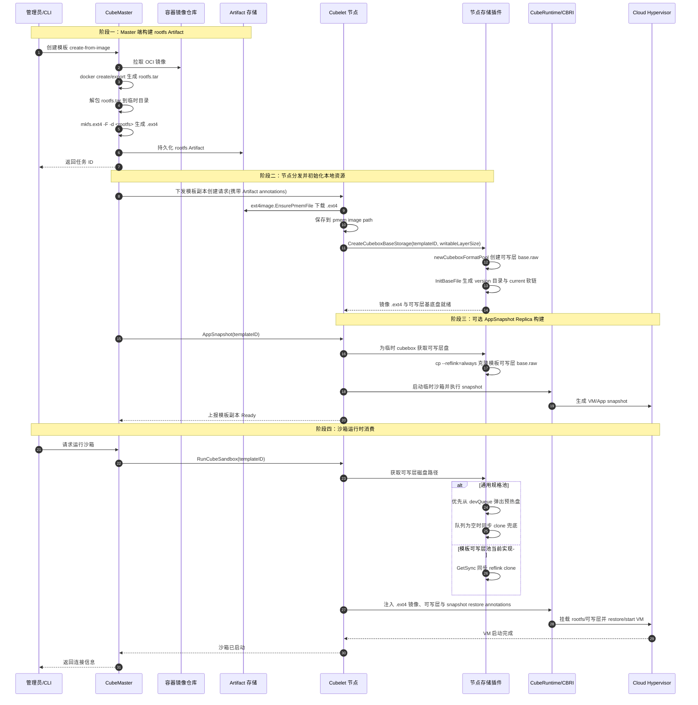

# Sandbox Rootfs 性能优化实现指南

本文面向需要继续开发 CubeSandbox rootfs 性能优化链路的工程师。目标不是解释“为什么快”，而是把端到端流程、现有代码入口、关键实现细节、当前实现边界、可继续落地的改造点和验收方式写清楚，使读者看完后可以直接进入代码开发。

## 目标与边界

### 目标

- 将沙箱启动链路中的 rootfs 重型工作前置到模板构建、Artifact 分发和节点后台池化阶段。
- 在节点侧使用宿主机 XFS Reflink 对 ext4 磁盘文件执行写时复制，降低 rootfs 分配时延和磁盘 I/O。
- 明确当前代码中的通用磁盘池、模板可写层池和 AppSnapshot Restore 的职责边界。
- 给出继续开发模板异步预热池、观测指标和测试验收时的代码落点。

### 非目标

- 不改变 Guest 内部看到的文件系统类型。Guest 仍然看到 ext4 rootfs。
- 不把 OCI 镜像运行时解包作为沙箱启动路径的一部分。
- 不要求所有节点都必须支持 Reflink。当前实现会在能力探测失败时退化到普通 copy。
- 不把 snapshot restore 和 rootfs reflink 混成同一个能力。rootfs reflink 解决磁盘分配，snapshot restore 解决虚拟机和应用运行态恢复。

## 关键实现细节速览

这条优化链路最容易被误读为“把一个 rootfs 文件从 Master 复制到节点，然后运行时直接挂载”。实际实现分成四类产物和两条性能路径：

| 产物/路径 | 代码入口 | 实现细节 | 当前边界 |
| --- | --- | --- | --- |
| Master rootfs Artifact | `buildRootfsArtifact`、`createExt4Image` | `docker create/export` 得到 rootfs，`mkfs.ext4 -F -d` 直接生成 `.ext4`；镜像大小按 rootfs 目录大小加 `256MiB` buffer、最小 `1GiB`、向上取 2 的幂 GiB | 这是模板构建产物，不是节点 Reflink clone 的运行时盘 |
| 节点 `.ext4` 下载 | `ext4image.EnsurePmemFile` | 按 annotations 下载 Artifact，落到 pmem image path，并用 SHA256 校验 | 该文件服务镜像分发/校验，不等同于 storage 池的 `base.raw` |
| 通用 Reflink 池 | `poolWithReflink` | `baseNum=100` 多分片，UUID CRC32 选分片，后台 worker clone、resize、fadvise 后入 `devQueue`，`Get()` 优先异步库存、空队列同步兜底 | 该路径已经具备异步预热消费能力 |
| 模板可写层 Reflink 池 | `cubeboxWithReflink` | `ver_<unixNano>` 版本目录、`current_tmp -> current` 原子软链切换、每版本多个 `base.raw` 分片 | 当前 `Get()` 直接调用 `GetSync()`，模板可写层运行时仍是同步 Reflink clone |
| AppSnapshot Restore | `appsnapshot.go`、`CubeShim/shim/src/sandbox/sb.rs` | 使用已准备的 rootfs 启动临时沙箱并生成 VM/App snapshot，运行时通过 annotation restore | 优化 VM/应用运行态恢复，不替代 rootfs clone |

后续改造时需要持续保持这几个关键实现边界：

:::: warning 关键边界
1. **核心产物概念严格隔离**：`.ext4` Artifact、节点模板可写层 `base.raw`、运行时 clone 文件、AppSnapshot Replica 是四类不同产物，开发排障与日志指标中不要混名。
2. **运行时真实能力探测**：`copy_reflink` 的验证机制是在节点插件启动时执行真实的 `cp --reflink=always` 测试，不盲信配置项；探测失败后自动降级为普通 `copy`。
3. **同步与异步边界的现状**：通用池已具备异步消费队列，模板可写层池当前仍为同步 clone，这是目前代码库中最关键的性能分水岭。
4. **`fadvise_size` 配置透传防劣化**：`fadvise_size` 虽为配置项，但新增池对象构造代码时必须显式透传给 `FAdviseSize`，否则将退化为只预读少量 ext4 元数据块。
::::

## 端到端关键流程图



### 流程说明

1. `create-from-image` 的重型工作在 CubeMaster 异步任务中执行，不进入用户实时启动路径。
2. Master 先从 OCI 镜像导出 rootfs，再用 `mkfs.ext4 -F -d` 直接把目录压制成 ext4 Artifact。
3. Cubelet 通过 `ext4image.EnsurePmemFile` 下载 Master 构建好的 `.ext4` 文件，并保存到 pmem image 路径；节点模板可写层池里的 `base.raw` 是 storage 插件为 `cube_rootfs_rw` 可写层创建和版本化管理的基底盘，两者不能混为同一个文件。
4. 节点存储插件启动时会探测 `copy_reflink` 是否可用；不可用时自动退化为 `copy`。
5. 通用规格池会后台维护 `devQueue`，运行时优先消费已经 clone 并 fadvise 的磁盘文件。
6. 模板可写层池 `cubeboxWithReflink` 已具备队列字段和后台补池方法，但当前 `Get()` 直接调用 `GetSync()`，所以模板可写层运行时仍然是同步 clone。
7. Template v2 的最终快开还依赖 AppSnapshot Replica。rootfs 优化减少磁盘准备耗时，snapshot restore 减少 VM/应用启动耗时。

## 代码入口地图

| 模块 | 文件 | 主要职责 |
| --- | --- | --- |
| Master 模板构建 | `CubeMaster/pkg/templatecenter/template_image.go` | `SubmitTemplateFromImage`、`buildRootfsArtifact`、`createExt4Image`，负责从 OCI 镜像生成 `.ext4` Artifact |
| Master 副本分发 | `CubeMaster/pkg/templatecenter/store.go` | `createTemplateReplicasOnNodes`、`createReplicaOnNode`，负责向节点创建模板副本和 AppSnapshot |
| Cubelet Artifact 下载 | `Cubelet/internal/cube/server/images/ext4image/utils.go` | `EnsurePmemFile`，根据 Master annotations 下载 `.ext4` 到 pmem image path 并校验 SHA256 |
| Cubelet AppSnapshot | `Cubelet/services/cubebox/appsnapshot.go` | 创建临时 cubebox、启动运行时、生成 snapshot replica |
| 存储插件配置 | `Cubelet/storage/plugin.go` | `Config`、`checkPoolType`，负责配置加载和 Reflink 能力探测 |
| 存储初始化 | `Cubelet/storage/local.go` | `local.init`、`initEmptyDir`、`initFormatPool`、`CreateCubeboxBaseStorage` |
| 通用池 | `Cubelet/storage/pool.go` | 普通 copy 池、`baseInfo.New`、`fadvise` |
| 通用 Reflink 池 | `Cubelet/storage/pool_withreflink.go` | `poolWithReflink`，后台补池、异步队列、同步兜底 |
| 模板可写层 Reflink 池 | `Cubelet/storage/cubeboxpool.go` | `cubeboxWithReflink`，模板可写层版本目录、基底盘分片、当前同步 clone |
| shell 操作封装 | `Cubelet/storage/shell.go` | `newExt4BaseRaw`、`newExt4RawByCopy`、`newExt4RawByReflinkCopy` |
| Cubelet 定制 Snapshotter | `Cubelet/plugins/snapshots/overlay/patchoverlay/overlay.go` | `patchoverlay` 实现，定制 `overlayfs` 支持 `refpath` 和 `upperdir` 标签 |
| Cubelet rootfs 组装 | `Cubelet/services/cubebox/cube_container_create.go` | `prepareContainerFiles`、`WithCubeFsAnnotation`、`prepareWritableRootfs`，负责把镜像 lowerdir、可写层盘和 virtio-fs 配置写入 OCI annotations |
| Cubelet rootfs 注解 | `Cubelet/services/cubebox/annotation.go` | `cube.rootfs.info`、`cube.disk`、`cube.rootfs.wlayer.path` 等运行时合同生成 |
| CBRI 注解 | `Cubelet/plugins/cbri/cubeboxcbri/cubebox.go` | 注入 rootfs、snapshot restore、kernel/image 路径等 annotations |
| Shim rootfs 翻译 | `CubeShim/shim/src/container/rootfs.rs`、`CubeShim/shim/src/container/mod.rs` | 解析 `cube.rootfs.info`，把宿主机路径改写为 Guest 内的 pmem、blk 或 virtio-fs 挂载路径 |
| Shim VM 设备配置 | `CubeShim/shim/src/sandbox/config.rs`、`CubeShim/shim/src/sandbox/sb.rs` | 解析 `cube.fs`、`cube.disk`、`cube.pmem`，启动 VM 时添加 virtio-fs、virtio-blk、pmem，并向 agent 下发 storage |
| Agent rootfs 挂载 | `agent/src/rpc.rs`、`agent/src/mount.rs`、`agent/rustjail/src/mount.rs` | Guest 内挂载 storage，构造容器 bundle rootfs overlay，并把额外挂载 bind 到容器内 |
| Shim Restore | `CubeShim/shim/src/sandbox/sb.rs` | `by_snapshot`、`restore_vm`、Cloud Hypervisor restore/start 逻辑 |

## Master 端 Artifact 构建

### 当前链路

Master 模板创建入口在 `SubmitTemplateFromImage`：

1. 接收镜像、模板 ID、规格等信息。
2. 创建异步任务，后台执行 `runTemplateImageJob`。
3. `ensureRootfsArtifact` 判断 Artifact 是否已经存在。
4. `buildRootfsArtifact` 完成镜像准备、rootfs 导出和 ext4 文件生成。
5. `distributeRootfsArtifact` 将 Artifact 信息下发到目标节点。

`buildRootfsArtifact` 的实现细节需要重点关注：

1. 工作目录使用 `artifactWorkRootDir()/artifactID`，最终存储目录由 `resolveArtifactStoreDir` 决定。
2. `exportImageRootfs` 通过 `docker create`、`docker export -o rootfs.tar`、`tar -xf` 得到干净的 rootfs 目录。
3. `relocateRootfsToArtifactStore` 把 rootfs 目录移动到 Artifact store，再由 `createExt4Image` 生成 `<artifactID>.ext4`。
4. `computeFileSHA256` 在 ext4 文件生成完成后计算 SHA256 和 size。
5. 只有在 SHA256、size、下载 token、生成后的模板创建请求都写入 DB 后，Artifact 才进入 `READY` 状态。
6. `keepStoreDir` 只有在整个构建成功后才置为 `true`；失败时 defer 会清理中间目录，避免半成品被节点下载。

`createExt4Image` 包含了一个决定全链路盘大小底线的关键实现细节：

:::: tip Rootfs 容量策略
它会先统计 rootfs 目录实际大小，并依据以下公式确定 ext4 镜像的物理大小：

```text
imageSize = nextPowerOfTwoGiB(max(directorySize(rootfsDir) + 256MiB, 1GiB))
```

也就是说，镜像最小为 `1GiB`；如果 rootfs 目录更大，则在实际目录大小基础上预留 `256MiB` buffer，再向上取到不小于该值的 2 的幂 GiB，例如 `1GiB`、`2GiB`、`4GiB`、`8GiB`。
::::

随后它用 `truncate` 创建目标文件，再用 `mkfs.ext4 -F -d <rootfsDir> <artifactPath>` 把解包后的 rootfs 目录直接写成 ext4 镜像。这样避免了“创建空盘 -> mount -> rsync/cp -> umount”的多步骤 I/O，也让模板构建产物在发布前具备确定的大小和校验值。

### 节点侧 Artifact 落盘

Master 在 `generateTemplateCreateRequest` 中把 Artifact 信息写入 image annotations，包括 Artifact ID、下载 URL、token、SHA256 和 size。Cubelet image service 进入 ext4 image 路径后调用 `ext4image.EnsurePmemFile`：

1. 根据 `instanceType` 和 `imageRef` 计算 pmem image path。
2. 如果本地 `.ext4` 已存在且有效，直接复用。
3. 如果不存在，通过 Master 下发的下载 URL 拉取 Artifact。
4. 下载过程中计算 SHA256，和 annotation 中的期望值比对。
5. 下载成功后 rename 到最终 `.ext4` 路径，并确保 kernel/version 文件就绪。

这条链路的产物是运行时镜像 `.ext4`，不是 XFS storage 池里的 `base.raw`。`base.raw` 属于节点 storage 插件，用于默认介质、模板可写层存储池和 Reflink clone。`generateTemplateCreateRequest` 会额外创建名为 `cube_rootfs_rw` 的 `EmptyDir` volume，并把它挂载到容器 `/`；这块可写层盘才进入 `cubeboxWithReflink` 池。

实现上要注意两个原子性边界：

- Master 端只有在 `.ext4` 文件完整生成、校验值计算完成、DB 状态更新为 `READY` 后才把它作为可下载 Artifact 暴露。
- Cubelet 端下载时应使用临时文件接收数据，校验通过后再 rename 到最终路径；这样重启或下载失败不会留下看起来可用的半文件。

### 开发注意事项

- Artifact 构建阶段应确保输出文件完整后再对外发布，避免节点下载半成品。
- Artifact ID、模板 ID、镜像 digest 应保持可追踪，便于排查“同模板不同节点 rootfs 不一致”的问题。
- `mkfs.ext4 -d` 的源目录必须是镜像导出的 rootfs 临时目录，不应包含构建过程中的临时元数据。
- 如果未来要支持多架构或多 rootfs 格式，Artifact 元数据需要显式记录架构、文件系统类型和容量。
- 容量策略目前隐含在 `createExt4Image` 中。如果后续开放用户可配置 rootfs 镜像容量，需要明确它和 `writable_layer_size`、模板可写层 format、节点 storage size 的关系。

## Cubelet 定制 Snapshotter (patchoverlay)

为了配合端到端的 rootfs 优化和快照恢复，Cubelet 并没有直接使用 containerd 原生的 `overlayfs` 驱动，而是实现了一个内建的定制版本：**`patchoverlay`**。

### 核心设计

- **插件注册**：在 `Cubelet/plugins/snapshots/overlay/plugin/plugin.go` 中，它以 `ID = "overlayfs"` 注册。这意味着它在 Cubelet 内部**动态替换**了 containerd 官方的 overlayfs 存储插件。
- **元数据增强**：
    - **`WithUpperdirLabel`**：它会自动为生成的快照添加 `containerd.io/snapshot/overlay.upperdir` 标签。这使得控制面能精准获知每一层镜像或可写层的物理路径，对于 `CubeShim` 动态构建 `virtio-fs` 挂载参数至关重要。
    - **`WithCubeUseRefPath`**：实现了 "RefPath" 引用路径机制。允许快照直接引用已存在的只读层或模板层，从而规避重复的磁盘分配和数据拷贝，极大地提升了大规模沙箱启动时的挂载效率。
- **持久化方案**：使用独立的 `metadata.db` (BoltDB) 管理快照层级，确保存储状态在 Cubelet 重启后可恢复。

### 对性能优化的贡献

在普通 OCI 容器场景下，snapshotter 只负责准备 UnionFS。但在 CubeSandbox 中，`patchoverlay` 是 **Host 存储资源（XFS/Reflink）与 Guest 虚拟设备（virtio-fs）之间的语义转换器**。它将 Artifact 展开后的物理路径映射为 OCI 标准的 snapshot ID，同时通过 labels 告知后续链路（如 CubeShim）该如何正确地通过 KVM 共享这些后端目录。

## 制作出的磁盘如何被 Shim 和 Agent 消费

rootfs 优化里“制作出的磁盘”至少有两类，需要分开看：

- **镜像只读 rootfs**：Master 构建出来的 `.ext4` Artifact，或 containerd snapshotter 解包出来的 OCI layer 目录。它们提供容器 rootfs 的 lowerdir。
- **容器可写层磁盘**：Cubelet storage 插件创建或 Reflink clone 出来的 ext4 raw 文件。它不是镜像内容本身，而是 overlayfs 的 `upperdir/workdir` 承载盘。

这两类产物最后都会通过 OCI annotations 交给 `containerd-shim-cube-rs`，再由 shim 转成 VM 设备和 agent storage。Guest 里的 `cube-agent` 负责真正 mount 设备、拼 overlay rootfs、启动容器进程。

### 普通 OCI 镜像路径：snapshotter 到 virtio-fs lowerdir

普通 Docker/OCI 镜像仍然先由 Cubelet 内嵌 containerd 拉取和 unpack。这里的关键不是把 snapshotter 生成的 overlay mount 直接交给 Guest，而是把 snapshotter 的物理层目录提取出来，再通过 virtio-fs 暴露给 Guest：

1. `PullImage` 使用配置里的 snapshotter 执行 `WithPullUnpack`。Cubelet 注册的 `overlayfs` 实际是 `patchoverlay`，因此镜像层会落在定制 snapshotter 管理的目录和 metadata 中。
2. `GenImageExtraAttributes` 通过 `rootfs.SnapshotRefFs(snapshotter, chainID)` 创建一个临时 view，读取 overlay mount 里的 `lowerdir=`，或读取 bind mount 的 `Source`，得到宿主机上的 layer `fs` 目录。
3. 这些目录被写入 image labels：公共前缀写入 `io.containerd.image/host-lower-dirs/prefix`，相对层路径写入 `io.containerd.image/layer/dirs`；无法压缩前缀时写入 `io.containerd.image/host-lower-dirs`。
4. 创建容器时，`prepareContainerFiles` 调用 `LocalResolve` 读出 `HostLayers`，再用 `rootfs.GenImageSharedDirs` 转成 `ShareDirMapping`。如果宿主路径以 `/fs` 结尾，会把 share 根目录上提一级，同时让 Guest 侧 mount path 保留 `<layer>/fs`。
5. `WithCubeFsAnnotation` 聚合所有容器的 share 目录，生成 `cube.fs`。这个 annotation 描述 virtio-fs 后端：`shared_dir=/data/cubelet/`，`allowed_dirs=<所有 layer 和 volume 的宿主路径>`。
6. `genVirtFsAnnotationOpt` 为每个容器写入 `cube.rootfs.info`，其中 `overlay_info.virtiofs_lower_dir` 是 Guest 侧将要看到的相对 lowerdir。
7. shim 解析 `cube.fs` 后给 Cloud Hypervisor 添加默认 virtio-fs 设备；sandbox 创建阶段把 storage 下发给 agent，agent 将这个 virtio-fs 挂到 `/run/cube-containers/shared/containers`。
8. shim 在 `RootfsInfo.fix_virtiofs()` 中把 `overlay_info.virtiofs_lower_dir` 改成 Guest 绝对路径，例如 `/run/cube-containers/shared/containers/<layer>/fs`。
9. agent 收到 `CreateContainerRequest` 后，`setup_bundle` 读取 `cube.rootfs.info`，把这些 lowerdir join 成 overlayfs 的 `lowerdir=a:b:c`，再在 Guest 内 mount 出 `/run/cube-containers/<cid>/rootfs` 作为容器 rootfs。

也就是说，containerd snapshotter 只在 **节点 Host 侧** 负责解包和管理 OCI layer；Guest 不直接理解 containerd snapshot。Guest 只看到 shim 和 agent 准备好的 virtio-fs 目录。

### ext4 Artifact 路径：pmem lowerdir 绕过 snapshotter

模板 rootfs 优化的 `.ext4` Artifact 路径和普通 OCI snapshotter 路径不同。这里镜像 rootfs 已经在 Master 模板阶段被压制成 ext4 文件，节点运行时不再走 containerd unpack，也不需要从 snapshotter 提取 lowerdir：

1. Master 用 `mkfs.ext4 -F -d <rootfsDir>` 生成 `.ext4` Artifact，并通过 annotations 下发 Artifact URL、token、SHA256、size。
2. Cubelet image service 识别 `storage_media=ext4` 后调用 `ext4image.EnsurePmemFile`，把 Artifact 下载到 `pmem.GetRawImageFilePath(instanceType, imageRef)`，形如 `<cubeToolBase>/<instanceType>_os_image/<imageRef>/<imageRef>.ext4`。
3. 创建容器时，`prepareContainerFiles` 不再生成 `overlay_info`，而是把 `CubeRootfsInfo.PmemFile` 设置为该 `.ext4` 文件路径。
4. `prepareImagePmems` 把这个文件写入 `cube.pmem` annotation：`file=<pmem .ext4>`、`fs_type=ext4`、`source_dir=/`、`discard_writes=true`。
5. shim 解析 `cube.pmem` 后，启动 VM 时把该文件作为 pmem/NVDIMM 设备加入 Cloud Hypervisor。
6. sandbox 创建阶段，shim 给 agent 下发 nvdimm storage：`source=/dev/pmemN`、`fstype=ext4`、`mount_point=/run/cube-containers/sandbox/pmem-cube/pmemN`、`options=ro,dax`。
7. container 创建前，shim 将 `cube.rootfs.info.pmem_file` 从宿主机 `.ext4` 路径改写成 Guest 内已挂载的 pmem 路径。
8. agent 的 `setup_bundle` 看到 `pmem_file` 后，把它作为 overlayfs lowerdir，再叠加容器自己的 upper/work，最终得到容器 rootfs。

因此 `.ext4` Artifact 的消费链路是 **Master 构建 -> Cubelet 下载校验 -> shim 注入 pmem 设备 -> agent 挂载 pmem -> agent overlay rootfs**。这条路径里 containerd snapshotter 不再参与 rootfs lowerdir 的生成。

### 可写层磁盘：storage 池到 overlay upper/work

无论 lowerdir 来自 OCI layer 还是 `.ext4` pmem，容器需要可写 rootfs 时都会走另一条磁盘链路：

1. 请求中需要有一个挂载到 `/` 的 `EmptyDir` volume。Cubelet storage 插件为该 volume 准备 ext4 raw 文件，普通路径来自通用池，模板路径来自 `cubebox/<templateID>` 的 Reflink clone。
2. `genStorageMediumDefaultAnnotationOpt` 把这个 raw 文件写入 `cube.disk`，字段包括 `path`、`fs_type=ext4`、`source_dir=disk`、`size`、`fs_quota`。
3. `prepareWritableRootfs` 同时写入 `cube.rootfs.wlayer.path=<宿主 raw 文件路径>` 和 `cube.rootfs.wlayer.subdir=disk/<containerID>`。
4. shim 解析 `cube.disk` 后启动 VM 时添加 virtio-blk 设备；sandbox 创建阶段 agent 将设备挂到 `/run/blk-cube/vdX`。
5. container 创建前，shim 根据 `disk_path_map` 把 `cube.rootfs.wlayer.path` 从宿主 raw 文件路径改写为 Guest 内路径，例如 `/run/blk-cube/vda/disk/<containerID>`。
6. agent 的 `setup_bundle` 读取改写后的 `cube.rootfs.wlayer.path`，在该路径下创建 `work/` 和 `upper/`，并用它们作为 overlayfs 的 `workdir` 和 `upperdir`。

`upper/` 和 `work/` 的目录创建动作发生在 Guest 内，但它们所在的文件系统来自节点上的 ext4 raw 文件。也就是说，agent 在 `/run/blk-cube/vdX/disk/<containerID>/upper` 写入的数据，最终会通过 Guest ext4 -> virtio-blk -> Host raw 文件落到节点磁盘上。如果模板可写层使用 Reflink，这个 Host raw 文件通常是从模板 `base.raw` clone 出来的运行时文件；容器写入只改变这个 clone 文件，不会修改模板基底盘。

这条路径可以简化成：

```text
container write
  -> Guest overlayfs upperdir
  -> Guest ext4 filesystem
  -> virtio-blk
  -> Host runtime raw file
  -> Host filesystem blocks
```

沙箱销毁时，Cubelet storage 的 destroy 流程会删除对应的运行时 raw 文件；`upper/` 中的数据也会随这个 raw 文件一起回收。因此当前语义下，可写层数据是沙箱生命周期内的数据，不是镜像 Artifact 或模板基底盘的一部分。

这里需要强调：**可写层磁盘不是镜像 rootfs Artifact**。它只承载运行时写入；镜像只读内容来自 pmem 或 virtio-fs lowerdir。Reflink 优化主要降低这类可写层 raw 文件的分配成本。

### 运行时合同总览

| Annotation | 生产方 | 消费方 | 作用 |
| --- | --- | --- | --- |
| `cube.rootfs.info` | Cubelet container create | shim、agent | 描述容器 rootfs lowerdir 来源：`pmem_file`、`overlay_info`、额外挂载等 |
| `cube.fs` | Cubelet `WithCubeFsAnnotation` | shim、agent | 描述默认 virtio-fs 后端和 allowed dirs，用于暴露 Host layer 目录 |
| `cube.pmem` | Cubelet `prepareImagePmems` | shim、agent | 描述 `.ext4` rootfs Artifact 对应的 pmem/NVDIMM 设备 |
| `cube.disk` | Cubelet storage annotation | shim、agent | 描述可写层或 volume raw 文件对应的 virtio-blk 设备 |
| `cube.rootfs.wlayer.path` | Cubelet `prepareWritableRootfs` | shim、agent | 指向 overlayfs upper/work 所在的可写层路径，shim 会从 Host 路径改写为 Guest 路径 |
| `cube.rootfs.wlayer.subdir` | Cubelet `prepareWritableRootfs` | shim | 指定可写层盘内的容器子目录，避免多个容器复用同一盘根目录 |

## 节点存储初始化

### 配置项

存储插件配置定义在 `Cubelet/storage/plugin.go`：

| 配置 | 含义 | 默认/当前行为 |
| --- | --- | --- |
| `root_path` | 插件状态根目录 | 为空时使用 containerd plugin state dir |
| `data_path` | 磁盘池数据根目录 | 为空时等于 `root_path`，非空时追加插件 ID 子目录 |
| `disksize` | 本地存储可用容量上限 | 必须可被 `resource.ParseQuantity` 解析 |
| `warningPercent` | 磁盘预警水位比例 | 默认 `100` |
| `pool_default_format_size_list` | 需要预热的默认规格列表 | 默认 `1Gi` |
| `base_disk_uuid` | ext4 基底盘 UUID | 默认 `ef5c2893-ddbd-4d6e-bef6-3853c31d5b94` |
| `pool_size` | 每个默认规格池目标库存 | 默认 `500`，初始化时会经过动态配置计算 |
| `pool_worker_num` | 后台补池 worker 数 | 默认 `8` |
| `fadvise_size` | 对 clone 文件做 `FADV_WILLNEED` 的字节范围 | 默认配置值 `256KiB`，但需要确认具体池构造时是否已透传 |
| `pool_type` | `copy` 或 `copy_reflink` | 为空默认 `copy`，探测失败也会退化为 `copy` |
| `pool_trigger_interval_in_ms` | 后台补池扫描间隔 | 默认 `1000` |
| `pool_trigger_burst` | 补池限速 burst | 非 0 时启用 rate limiter |
| `disable_disk_check` | 是否禁用磁盘容量检查 | 按现有代码语义使用 |
| `free_blocks_threshold` | 空闲 blocks 阈值 | 默认 `15` |
| `free_inodes_threshold` | 空闲 inodes 阈值 | 默认 `15` |
| `reconcile_interval` | 周期 reconcile 间隔 | 默认 `5m` |

### Reflink 能力探测

`checkPoolType` 在插件初始化早期执行：

1. 仅当配置为 `copy_reflink` 时执行探测。
2. 在 `data_path` 下创建测试 `base.raw`。
3. 调用 `newExt4RawByReflinkCopy(base, target, 0)`。
4. 任一步失败都把 `PoolType` 改回 `copy`。

`newExt4RawByReflinkCopy` 当前通过 `cp --reflink=always` 触发内核 Reflink 能力。实现上不需要在 Go 里直接调用 `ioctl(FICLONE)`，但底层语义就是文件级写时复制。

这里的实现意图是“用真实 clone 结果决定运行模式”。因此不要把 `pool_type=copy_reflink` 当成最终状态；最终状态要看探测后的 `PoolType`。后续加日志或指标时，应同时记录：

- 用户配置的 `pool_type`。
- 探测后的实际 `PoolType`。
- 探测失败时的原始错误。
- 探测发生的 `data_path`，因为 Reflink 能力和具体挂载点有关。

### 目录结构

节点本地磁盘池位于 `<data_path>/emptydir`：

```text
<data_path>/emptydir/
  1Gi/                         # copy 模式
    base.raw
    <uuid>
    ...
  1Gi/                         # copy_reflink 模式
    0/base.raw
    0/<uuid>
    1/base.raw
    1/<uuid>
    ...
  othersv2/
    0/base.raw
    0/<uuid>
    1/base.raw
    1/<uuid>
    ...
  cubebox/
    <templateID>/
      format
      base.raw
      current -> ver_<timestamp>
      ver_<timestamp>/
        0/base.raw
        0/<uuid>
        1/base.raw
        1/<uuid>
        2/base.raw
        2/<uuid>
        ...
```

说明：

- `1Gi/` 等默认规格目录由 `initFormatPool` 创建，用于没有模板基底盘的通用 rootfs；`copy` 模式是单基底文件，`copy_reflink` 模式会拆成多个分片目录。
- `othersv2/` 是非默认规格或兜底路径使用的池。
- `cubebox/<templateID>/base.raw` 是模板可写层的当前源文件，由 `newCubeboxFormatPool` 根据 `writable_layer_size` 创建，不是 Master `.ext4` Artifact 的落盘文件。
- `cubebox/<templateID>/current` 机制用于模板基底盘版本切换。`current` 指向当前可用版本目录。
- `ver_x/<n>/base.raw` 是模板可写层池的多个基底分片，运行时 clone 会按 UUID 的 CRC32 分散到不同分片，降低热点。

`current` 软链是模板可写层池版本切换的核心边界。新版本目录没有全部准备好之前，不能替换 `current`；替换后，新请求才应该从新版本的分片 clone。这个边界会直接影响“模板更新后是否可能拿到旧可写层”。

## XFS Reflink 池构建细节

### 宿主与 Guest 的文件系统关系

这里容易混淆，需要明确分层：

- 宿主机数据目录建议位于支持 Reflink 的 XFS 文件系统上。
- `base.raw` 是宿主机上的普通大文件。
- `base.raw` 文件内部格式是 ext4，作为模板可写层挂给 Guest；Master 下发的 `.ext4` Artifact 则通过 pmem image path 注入。
- Reflink 发生在宿主机 XFS 层，对 `base.raw` 文件的数据块做 CoW 共享。
- Guest 写 ext4 时，最终表现为对宿主 `base.raw` clone 文件的写入；XFS 会在被写块上执行 CoW 分裂。

### 通用 Reflink 池

`poolWithReflink.init` 的构建逻辑：

1. 为一个规格创建 `baseNum=100` 个分片目录。
2. 每个分片目录里准备一个 `base.raw`。
3. 解析 ext4 block group descriptor，得到预取块：`0`、`1`、`2` 和 `gd.InodeTable`。
4. 启动 worker 和 `daemonSupplementQueue`。
5. 后台按库存水位调用 `put()` 创建 clone 文件。
6. `put()` 生成 UUID，通过 CRC32 选择分片，再调用 `baseInfo.New()`。
7. `baseInfo.New()` 执行 `cp --reflink=always`，必要时 `truncate/e2fsck/resize2fs`，最后调用 `fadvise`。
8. clone 完成后放入 `devQueue`。
9. `Get()` 优先从 `devQueue` 获取，队列为空或文件丢失时调用 `GetSync()` 兜底。

运行时路径可以理解为两段：

- 后台路径：`daemonSupplementQueue -> worker -> put -> baseInfo.New -> expandDone`。它负责把 clone、可选 resize 和 fadvise 的成本提前消化掉。
- 前台路径：`Get -> getAsync -> devQueue.Dequeue`。队列命中时只做库存消费和文件存在性校验；队列未命中时才进入 `GetSync`。

`baseInfo.New` 是单个 ext4 磁盘文件真正创建的位置。Reflink 模式下它调用 `newExt4RawByReflinkCopy`；如果请求 size 大于基底盘，还会走 `truncate/e2fsck/resize2fs`，最后统一调用 `fadvise(newFilePath, FAdviseSize, prefetchBlocks)`。因此性能指标最好分别拆 clone、resize 和 fadvise，而不是只记录一个总耗时。

### 模板可写层 Reflink 池

`cubeboxWithReflink` 的职责和通用池类似，但多了模板可写层版本管理：

1. `newCubeboxFormatPool` 为 `templateID` 创建目录和临时 `base.raw`。
2. `InitBaseFile` 检查 `base.raw`，创建新版本名 `ver_<unixNano>`。
3. `prepareNewVersion` 在版本目录下创建 `0..baseNum-1` 分片目录。
4. 每个分片目录用 `utils.SafeCopyFile` 从模板 `base.raw` 准备一份分片基底盘。注意当前 `SafeCopyFile` 是 `io.Copy` 全量复制，它发生在模板初始化/版本切换阶段，不在沙箱实时启动路径。
5. `current_tmp` 软链创建成功后，通过 `os.Rename` 原子替换 `current`。
6. 旧版本目录异步删除。
7. Cubelet 重启时 `initCubeboxFormatPool` 读取 `current` 并 `loadExistingVersion` 恢复索引。

这里是当前实现中最容易误解和最具优化价值的技术债区域：

:::: warning 模板可写层池尚未异步消费
- `cubeboxWithReflink.Get(ctx, size)` 当前方法体直接返回 `GetSync(ctx, size)`。
- 这意味着模板可写层目前没有实际消费 `devQueue` 异步库存。
- 尽管 `daemonSupplementQueue` 等异步机制骨架已经写好，但初始化路径并未完整透传配置，也未启动后台 worker。
- 涉及模板高并发突发启动的性能压测，其可写层准备成本大概率仍会卡在同步 clone 和 resize 上。继续缩短 Ready Time 必须先解决模板可写层池异步预热改造。
::::

这也是后续实现时最容易踩坑的地方：模板可写层池不是缺少“clone 能力”，而是缺少“把 clone 产物提前生产并正确消费”的完整闭环。要完成这个闭环，至少要同时处理以下细节：

- 创建和重启恢复路径都要初始化 `devQueue`、`ch`、`exitCh`、`limiter`、`cap` 和 worker 数。
- 版本切换后要隔离旧 `devQueue`，否则旧版本 clone 可能在新 `current` 生效后被继续分配。
- `put()` 当前使用 `pIndex.New(newFilePath, 0)`，表示库存盘按模板基底尺寸创建；如果运行时允许请求更大 size，要么按 size 维度拆队列，要么让异步库存只服务固定模板规格。
- `Close()` 依赖 `poolWorkers` 给 `exitWg` 增加计数；如果只初始化了 `exitCh` 但没有正确设置 worker 数和启动 worker，关闭路径也需要一起校验。

## 运行时获取磁盘文件

通用池和模板可写层池都实现 `Pool` 接口：

```go
type Pool interface {
    Get(ctx context.Context, size int64) (*devInfo, error)
    GetSync(ctx context.Context, size int64) (*devInfo, error)
    Close()
    InitBaseFile(ctx context.Context) error
}
```

通用池行为：

- `Get()` 先调用 `getAsync()` 消费 `devQueue`。
- 库存命中后会检查文件仍然存在，然后返回文件路径。
- `getAsync()` defer 调用 `TriggerExpand()`，消费库存后会顺手触发补池。
- 库存未命中、文件丢失或队列为空时，调用 `GetSync()` 同步创建，避免启动失败。

模板可写层池当前行为：

- `Get()` 等价于 `GetSync()`。
- 每次运行时都同步执行一次 Reflink clone。
- Reflink 本身仍然很快，但高并发模板启动时无法把 clone、resize、fadvise 完全挪到后台。
- `getAsync()`、`TriggerExpand()`、`daemonSupplementQueue()` 等方法已经存在，但在当前运行时入口没有被 `Get()` 使用。

## fadvise 与冷启动

`fadvise` 位于 `Cubelet/storage/pool.go`：

1. 打开 clone 后的新文件。
2. 读写 offset `0` 的 1 字节，触发必要的元数据路径。
3. 如果 `size > 0`，对 `[0, size)` 调用 `unix.Fadvise(..., FADV_WILLNEED)`。
4. 对 ext4 关键元数据块调用 `FADV_WILLNEED`，包括 superblock 附近块和 inode table。

开发时需要注意：

- `posix_fadvise` 是 hint，不保证数据立即进入 Page Cache。
- `FAdviseSize` 目前是配置项，但需要确认所有池构造路径都把 `l.config.FAdviseSize` 赋值给池对象，否则只会预取显式 block 列表。
- 对大范围执行 fadvise 会增加后台 I/O，建议通过指标观察 cache 命中收益和磁盘压力。

## 后续开发任务拆解

### 任务一：补齐观测指标

建议先做，因为它能证明后续优化是否有效。

代码落点：

- `Cubelet/storage/pool_withreflink.go`
- `Cubelet/storage/cubeboxpool.go`
- `Cubelet/storage/pool.go`
- `Cubelet/plugins/workflow` 现有 metric 接入点

建议指标：

| 指标 | 维度 | 说明 |
| --- | --- | --- |
| `storage_pool_get_total` | `pool_type,format,template_id,result,path` | `path=async/sync/fallback` |
| `storage_pool_queue_length` | `pool_type,format,template_id` | 当前库存长度 |
| `storage_pool_inflight` | `pool_type,format,template_id` | 后台正在 clone 的数量 |
| `storage_pool_clone_seconds` | `pool_type,format,template_id,result` | `cp --reflink` 或 copy 耗时 |
| `storage_pool_resize_seconds` | `pool_type,format,template_id,result` | `e2fsck/resize2fs` 耗时 |
| `storage_pool_fadvise_seconds` | `pool_type,format,template_id,result` | fadvise 耗时 |
| `storage_pool_recover_total` | `pool_type,format,result` | 重启恢复库存数量 |
| `storage_pool_reflink_probe_total` | `result` | 插件启动时能力探测结果 |

验收标准：

- 可以区分异步命中和同步兜底。
- 可以看到模板可写层池是否仍然走同步路径。
- Reflink 探测失败时有明确日志和 metric，不只是在配置里静默退化。

### 任务二：显式透传 FAdviseSize

代码落点：

- `initFormatPool` 创建 `pool` 和 `poolWithReflink` 时设置 `FAdviseSize: int64(l.config.FAdviseSize)`。
- `initOtherFormatPool` 创建 `pool` 和 `poolWithReflink` 时设置 `FAdviseSize`。
- `newCubeboxFormatPool`、`initTmpCubeboxFormatPool`、`initCubeboxFormatPool` 创建 `cubeboxWithReflink` 时设置 `FAdviseSize`。

验收标准：

- 配置 `fadvise_size` 后，`fadvise(filePath, size, blocks)` 收到的 `size` 与配置一致。
- 单测覆盖默认值和显式配置值。
- 不改变 `fadvise_size <= 0` 时只预取关键 ext4 blocks 的兼容行为。

### 任务三：模板可写层池异步预热

目标是让模板可写层池从当前同步 clone 变成“优先异步库存，库存不足再同步兜底”。

建议改造点：

1. 在创建 `cubeboxWithReflink` 的所有路径透传：
   - `cap: dynamConf.GetPoolSizeForInit(l.config.PoolSize)`
   - `poolWorkers: l.config.PoolWorkers`
   - `triggerIntervalInSecond: l.config.PoolTriggerIntervalInMs`
   - `triggerBurst: l.config.PoolTriggerBurst`
   - `FAdviseSize: int64(l.config.FAdviseSize)`
2. 在 `initCubeboxFormatPool` 的 `initMultiBaseFile` 成功后调用 `p.start()`。
3. 在 `InitBaseFile` 完成 `updateBaseFile` 后，确保新版本的 `indexMap` 已切换，再触发预热。
4. 将 `cubeboxWithReflink.Get()` 改为：

```go
func (p *cubeboxWithReflink) Get(ctx context.Context, size int64) (*devInfo, error) {
    device, err := p.getAsync(ctx)
    if err == nil {
        if ok, statErr := utils.DenExist(device.FilePath); ok {
            return device, nil
        }
        log.G(ctx).Errorf("%s in cubebox pool not exist, err:%v", device.FilePath, statErr)
    }
    log.G(ctx).Warnf("%s cubebox pool has no more devs", p.format)
    return p.GetSync(ctx, size)
}
```

5. `put()` 创建库存时需要明确 size 策略：
   - 如果模板可写层池 clone 出来的盘大小固定为模板规格，则 `pIndex.New(newFilePath, 0)` 即可。
   - 如果运行时可能请求大于模板规格的 size，则库存需要按规格维度拆分，或保持同步 resize 兜底，避免队列里混入错误大小的磁盘。

验收标准：

- 模板运行时首次高并发启动时，指标能看到 `path=async` 命中。
- 队列为空时仍然可同步兜底，不因后台池不足导致启动失败。
- 模板更新版本后，新库存来自新 `current` 指向的版本目录，旧库存不会继续被消费。
- Cubelet 重启后可以恢复已有模板版本，并重新启动补池协程。

### 任务四：模板版本切换安全性

代码落点：

- `cubeboxWithReflink.InitBaseFile`
- `cubeboxWithReflink.updateBaseFile`
- `cubeboxWithReflink.prepareNewVersion`
- `local.destroyCubeBoxTemplateBase`

建议约束：

- 新版本所有分片 `base.raw` 准备成功后，才允许替换 `current`。
- `current` 替换必须继续使用 `current_tmp -> rename` 的原子切换方式。
- 旧版本删除前，需要确保旧版本库存不会再被发给新请求。
- 如果启用模板异步预热，版本切换时要清理或隔离旧 `devQueue`。
- `templateID` 必须只作为路径段使用，必要时增加校验，避免路径穿越。

验收标准：

- 构造 `prepareNewVersion` 中途失败，新 `current` 不切换。
- Cubelet 重启时读取 `current` 能恢复最新版本。
- 旧版本删除失败只影响空间回收，不影响新模板运行。

### 任务五：Reflink 退化和容量控制

代码落点：

- `checkPoolType`
- `newExt4RawByReflinkCopy`
- `newExt4RawByCopy`
- `local.incrSize` / 容量检查相关逻辑

建议行为：

- `copy_reflink` 探测失败时明确记录失败原因。
- 退化为 `copy` 后仍然保持功能可用，但指标中能看到退化。
- 对 Reflink clone 的逻辑容量和物理容量区别要说明清楚：`usedDiskSize` 是虚拟使用量，不等于 XFS 实际占用块。
- 容量检查应同时关注插件虚拟容量、宿主文件系统 free blocks 和 free inodes。

验收标准：

- 在不支持 Reflink 的目录上启动，插件自动使用 `copy`。
- 在支持 Reflink 的 XFS 上启动，插件保持 `copy_reflink`。
- 手工填满 blocks 或 inodes 时，沙箱创建能给出清晰错误。

## 测试与验收清单

### 单元测试

建议补充或扩展以下测试：

- `Cubelet/storage/cubeboxpool_test.go`
  - `InitBaseFile` 创建 `ver_x`、分片目录和 `current`。
  - `prepareNewVersion` 失败时不切换 `current`。
  - `DisableCubeBoxTemplateBaseFormatPoolOfNumberVer` 打开时清理旧数字目录。
  - 模板异步池开启后，`Get()` 优先消费 `devQueue`，空队列同步兜底。
- `Cubelet/storage/local_test.go`
  - `pool_size/pool_worker_num/fadvise_size` 默认值和透传。
  - `initFormatPool` 对 `pool` 和 `poolWithReflink` 的字段赋值完整。
- `Cubelet/storage/shell_test.go`
  - `newExt4RawByReflinkCopy` 在 size 为 0 和非 0 时的命令行为。
  - resize 失败时返回错误，不吞掉异常。

### 手工验证

在真实 XFS 节点上验证：

```bash
xfs_info <mount-point> | grep reflink=1
cp --reflink=always base.raw clone.raw
```

验证通用池：

```bash
# 启动 cubelet 后观察默认规格目录
find <data_path>/emptydir/1Gi -maxdepth 2 -type f | head

# 创建一个默认规格沙箱，确认优先从池里拿文件
# 观察 storage_pool_get_total{path="async"} 或日志
```

验证模板可写层池：

```bash
# 创建模板后观察模板目录
find <data_path>/emptydir/cubebox/<templateID> -maxdepth 3 -type f
readlink <data_path>/emptydir/cubebox/<templateID>/current

# 创建使用该模板的沙箱
# 当前代码预期：模板可写层池走 GetSync
# 如果完成异步改造，预期：优先 path=async，库存不足 path=sync
```

验证重启恢复：

```bash
# 创建模板并确认 current 存在后重启 cubelet
# 重启后再次创建沙箱，确认 initCubeboxFormatPool/loadExistingVersion 成功
```

验证退化路径：

```bash
# 在不支持 reflink 的目录上配置 pool_type=copy_reflink
# 启动后确认实际 PoolType 退化为 copy，并且日志/指标记录原因
```

## 风险与边界条件

- XFS Reflink 只减少 clone 时的全量复制，不消除后续写入放大。高写入 workload 会触发 CoW 分裂并产生碎片。
- `fadvise` 只是内核 hint，不应作为强一致预热保证。
- 如果 clone 后请求 size 大于基底盘，`truncate/e2fsck/resize2fs` 仍然可能成为同步耗时来源。
- 模板可写层池异步预热需要处理版本切换和旧库存隔离，否则可能把旧版本可写层分配给新沙箱。
- `.ext4` Artifact、节点模板可写层 `base.raw`、运行时 clone 文件、AppSnapshot Replica 是四类不同产物，日志和指标中应避免混用名称。
- Reflink clone 文件共享底层块，误删 clone 不影响 base，但误删 `base.raw` 或当前版本分片会影响后续分配。

## 推荐开发顺序

1. 先补观测指标和 Reflink 探测日志，建立性能基线。
2. 补齐 `FAdviseSize` 配置透传，确保现有预热逻辑按配置生效。
3. 为模板可写层池加异步库存，但保留 `GetSync` 兜底。
4. 加强模板版本切换测试，覆盖失败回滚、重启恢复和旧库存隔离。
5. 最后做压测，对比 `copy`、`copy_reflink sync`、`copy_reflink async`、`snapshot restore` 的分阶段耗时。
