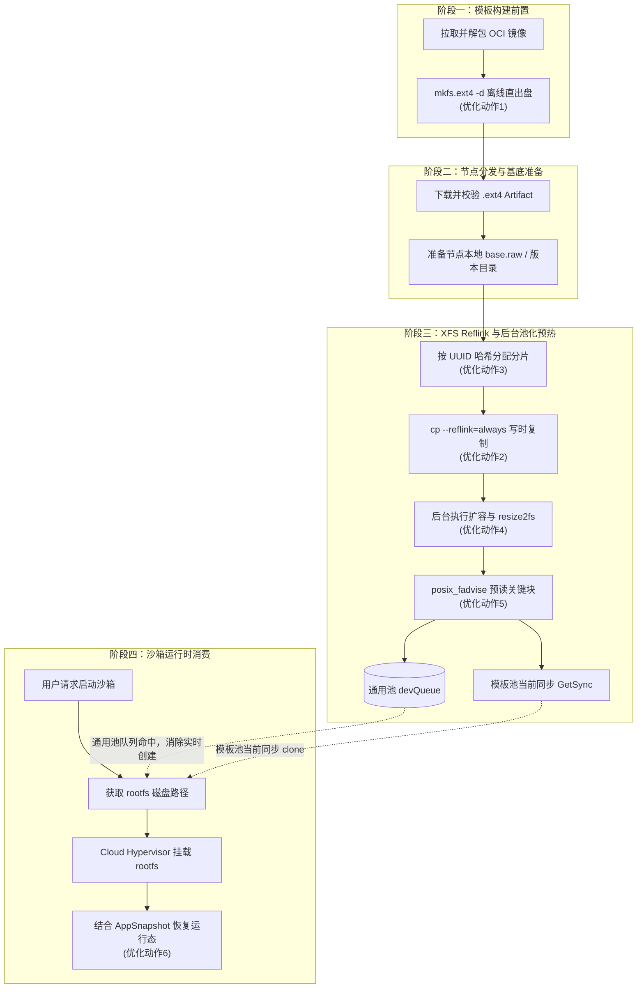

# 深入解析：CubeSandbox 如何全链路优化 Rootfs 创建耗时

本文面向想理解 CubeSandbox rootfs 启动性能优化思路的读者。它解释的是“为什么能快”和“快在哪里”，更细的代码入口、改造点和验收方式请继续阅读 [Sandbox Rootfs 性能优化实现指南](./sandbox-rootfs-performance-implementation)。

## 背景：Rootfs 创建为什么会成为瓶颈

在沙箱系统中，虚拟机实例启动前必须先获得一块可写 rootfs。传统路径通常把大量工作压在用户请求的实时链路上：

1. 从镜像仓库拉取 OCI 镜像。
2. 解压镜像层，得到本地 rootfs 目录。
3. 使用 `truncate` 创建空白磁盘文件。
4. 使用 `mkfs.ext4` 初始化文件系统。
5. 将 rootfs 目录全量拷贝到挂载后的 ext4 磁盘。
6. 启动 MicroVM，让 Guest 第一次读取这块冷磁盘。

这条链路的问题不是某一个命令慢，而是它把“下载、解压、格式化、全量复制、冷读”串成了同步路径。并发启动时，大文件复制会迅速耗尽宿主机磁盘 I/O，随后 Page Cache 不命中又会把冷启动抖动继续放大。

CubeSandbox 的优化目标不是发明新的 Guest 文件系统，也不是牺牲 ext4 语义，而是重新安排这些重型工作的发生时机：能在模板阶段做的，不放到实例启动阶段；能在节点后台做的，不放到用户请求路径；能用宿主文件系统元数据表达的，不做全量数据复制。

## 目标与非目标

### 目标

- 将 OCI 镜像导出、rootfs 解包和 ext4 镜像构建前置到模板构建阶段。
- 在节点侧使用支持 Reflink 的宿主文件系统，对 ext4 磁盘文件做写时复制。
- 用后台预热池吸收 `truncate`、`e2fsck`、`resize2fs` 和 Page Cache 预取成本。
- 将 rootfs 磁盘准备和 AppSnapshot Restore 分层理解，分别优化磁盘分配和 VM/应用恢复。

### 非目标

- 不改变 Guest 看到的 rootfs 类型。Guest 仍然挂载 ext4。
- 不要求每台节点都必须支持 XFS Reflink。不支持时应退化为普通 copy。
- 不把 rootfs Reflink 和 snapshot restore 混成同一个能力。前者解决磁盘文件分配，后者解决 VM 与应用运行态恢复。
- 不把模板构建时的全量拷贝误认为运行时成本。模板初始化阶段可以慢一些，用户请求路径必须快。

## 核心关键优化动作

为了实现极速启动，CubeSandbox 在整个 Rootfs 准备链路上实施了以下几个核心的底层优化动作：

1. **`mkfs.ext4 -d` 离线直出镜像**
   - **动作**：在模板构建阶段，不挂载空盘，直接使用 `mkfs.ext4 -d <rootfs_dir>` 命令将 OCI 镜像解压后的目录内容压制成一个 ext4 镜像文件 (`.ext4` Artifact)。
   - **效果**：彻底消除沙箱运行时“拉取、解包、创建空盘、挂载、全量拷贝”的多段重型 I/O 操作。

2. **`cp --reflink=always` 宿主级写时复制 (CoW)**
   - **动作**：节点侧存储池依赖 XFS 文件系统的 Reflink 特性，通过 `cp --reflink=always` (底层等价于 `ioctl(FICLONE)`) 瞬间克隆出沙箱专用的 ext4 rootfs 磁盘文件。
   - **效果**：将 GB 级别的数据块拷贝降维成极其轻量的元数据指针复制，极大缓解并发启动时的宿主机 I/O 瓶颈。

3. **多基底分片打散 (缓解元数据热点)**
   - **动作**：针对同一规格或同一模板基底，后台维护多个 `base.raw` 副本目录；通用 Reflink 池当前为 100 个分片，模板池当前为 3 个分片。运行时根据沙箱 UUID 计算哈希，将 clone 请求打散到不同分片。
   - **效果**：有效避免高并发启动时，所有 clone 操作争抢读取同一个底层文件的 inode 和元数据锁。

4. **异步预热池与扩容隐藏**
   - **动作**：通用规格池通过后台 Worker 提前执行 clone 操作，并将可能发生的耗时动作（如 `truncate` 扩容、`e2fsck` 检查和 `resize2fs` 文件系统刷新）消化在后台，产出放入 `devQueue`。
   - **效果**：通用池请求到来时，优先从队列弹出一块“已扩容、已就绪”的盘，将不可控的磁盘调整耗时移出用户实时路径。模板池当前仍以同步 Reflink clone 为主，边界见下文。

5. **`posix_fadvise` 关键数据预读**
   - **动作**：克隆盘创建后，对其调用 `posix_fadvise(..., FADV_WILLNEED)`，提示内核将 ext4 的关键元数据（如 Superblock、Inode Table 等）及头部数据块读入 Page Cache。当前实现主要预取显式 ext4 关键块；如果要按 `fadvise_size` 扩大连续预取范围，还需要确保池对象正确透传 `FAdviseSize`。
   - **效果**：大幅减少 Cloud Hypervisor 启动虚拟机首次挂载 rootfs 时的冷读缺页中断 (Page Fault)，削平冷启动毛刺。

6. **AppSnapshot Restore 恢复运行态**
   - **动作**：在模板准备阶段预先启动一次沙箱并生成 VM/应用快照，后续实例创建时由 Runtime 基于快照恢复。
   - **效果**：在 rootfs 快速准备之外，进一步跳过 VM 冷启动和应用初始化过程。

## 全链路优化视图

CubeSandbox 将“创建一块可运行系统盘”拆成四个阶段：



其中最重要的变化是：用户点击“启动沙箱”时，系统尽量只做“拿到一条已经准备好的磁盘路径，并交给 Runtime”这件事。通用规格池可以通过 `devQueue` 将这条路径压到最短；模板池当前仍需要同步 Reflink clone，但已经避开了镜像拉取、解包和全量写盘。

## 阶段一：把镜像到 ext4 的重型构建前置

模板创建时，CubeMaster 会把 OCI 镜像转换成一个可复用的 rootfs Artifact。这个阶段发生在模板准备链路，不进入用户实时启动路径。

### 构建方式

CubeMaster 的核心动作是：

1. 拉取并解析源镜像。
2. 通过容器运行时导出 `rootfs.tar`。
3. 解包到临时 rootfs 目录。
4. 使用 `mkfs.ext4 -F -d <rootfsDir> <artifactPath>` 直接生成 ext4 镜像文件。
5. 记录 Artifact ID、大小、SHA256 等元数据。

`mkfs.ext4 -d` 是这里的关键点。它可以在不 mount 目标盘的情况下，把目录内容直接写入 ext4 文件系统镜像，避免“空盘格式化 -> mount -> rsync/cp -> umount”的多段式 I/O。

### 为什么这一步有效

传统路径会为每次沙箱启动重复执行镜像解包和 rootfs 写盘。CubeSandbox 把这一步变成模板级一次性产物：同一个模板的多个沙箱实例共享同一个 Artifact 来源，后续节点只需要下载、校验并复用。

需要注意的是，Master 生成的 `.ext4` Artifact 和节点 storage 池中的 `base.raw` 是两个层次：

- `.ext4` Artifact 是模板 rootfs 的分发产物。
- `base.raw` 是节点本地 storage 插件用于 clone 的基底盘文件。

理解这层边界，可以避免把“Artifact 下载”和“Reflink clone”混在一起排查。

## 阶段二：节点侧用 Reflink 把复制变成元数据操作

节点拿到可复用的基底文件后，真正的性能拐点来自宿主机文件系统的写时复制能力。推荐的宿主数据目录是启用了 Reflink 的 XFS 文件系统。

### 宿主与 Guest 的分层

这一层很容易混淆：

- 宿主机上看到的是普通大文件，例如 `base.raw` 和每个沙箱的 rootfs clone 文件。
- 这些大文件内部是 ext4 文件系统。
- Guest 启动后看到并挂载的是 ext4 rootfs。
- Reflink 发生在宿主机 XFS 层，对大文件的数据块做 CoW 共享。

也就是说，CubeSandbox 没有改变 Guest 文件系统语义。它只是利用宿主机 XFS 的能力，让多个 ext4 镜像文件在初始状态共享相同物理数据块。

### 能力探测与退化

节点存储插件不会盲目相信配置。启用 `copy_reflink` 时，它会执行一次真实探测，尝试运行 `cp --reflink=always`：

- 探测成功：走 Reflink clone，底层语义等价于 `ioctl(FICLONE)`。
- 探测失败：退回普通 copy，功能保持可用，但性能收益下降。

这个设计保证了跨节点、跨内核、跨磁盘格式部署时的兼容性。生产环境应把“是否退化到 copy”作为启动时日志和指标重点观察项。

### Reflink 的收益边界

Reflink 并不是让数据消失，而是延迟复制：

- 创建 clone 文件时，大部分成本是元数据操作，不需要复制 10GB 级数据块。
- 沙箱只读访问模板内容时，多实例共享底层数据块。
- 沙箱写入自己的 rootfs 时，宿主 XFS 对被写块执行 CoW 分裂。

因此它最适合“模板大、启动多、初始写入相对有限”的沙箱场景。如果业务启动后会立即大量改写 rootfs，CoW 分裂成本会在运行期逐步出现，需要通过可写层大小、临时目录挂载和业务写入路径规划来控制。

## 阶段三：用预热池隐藏扩容和冷读成本

Reflink 把大文件复制降到很低，但并不意味着 rootfs 文件已经完全可启动。不同规格可能需要扩容，首次读取也可能触发冷 Page Cache。CubeSandbox 通过节点后台池化继续把这些成本移出实时路径。

### 多分片降低热点

通用 Reflink 池会为同一规格准备多个基底分片目录，当前默认是 100 个分片，例如：

```text
<data_path>/emptydir/1Gi/
  0/base.raw
  1/base.raw
  2/base.raw
  ...
```

运行时创建 clone 时，根据 UUID 哈希选择不同分片，避免所有并发请求都争抢同一个 `base.raw` 的元数据路径。这个策略对高并发冷启动尤其重要。模板 Reflink 池也采用分片思想，但当前默认分片数是 3。

### 后台补池与 devQueue

通用规格池会启动后台 worker，持续维持目标库存：

1. 选择一个基底分片。
2. 通过 Reflink 或 copy 创建新的 rootfs 文件。
3. 如请求规格大于基底规格，执行 `truncate`。
4. 执行 `e2fsck` 与 `resize2fs`，让 ext4 文件系统识别新的边界。
5. 调用 `posix_fadvise(..., FADV_WILLNEED)` 预取关键范围。
6. 把准备好的文件放入 `devQueue`。

当真实沙箱启动请求到来时，通用池优先从 `devQueue` 弹出已经准备好的磁盘文件。命中库存时，实时路径基本只剩一次队列消费和路径传递。

### 当前模板池边界

需要特别说明：通用规格池已经具备异步 `devQueue` 消费路径；模板 Reflink 池当前代码虽然保留了队列和后台补池相关结构，但运行时 `Get()` 仍直接走同步 `GetSync()` clone。

因此，在描述当前实现时应区分：

- 通用 rootfs 池：可以通过 `devQueue` 消费预热盘。
- 模板 rootfs 池：当前主要收益来自模板构建前置、版本化基底、多分片和同步 Reflink clone；如果要达到“模板实例运行时也直接弹出预热盘”，还需要完成模板异步预热池改造。

这个边界非常关键。它决定了性能压测中看到的耗时应该归因到哪里，也决定了下一步优化的工程落点。

## 阶段四：用 fadvise 和 Snapshot Restore 消除剩余冷启动

Rootfs 文件创建得快，只解决了磁盘路径准备问题。MicroVM 第一次启动时仍然会读取内核、init、运行时依赖和业务入口文件。CubeSandbox 用两层手段继续压缩 Ready Time。

### Page Cache 预取

`posix_fadvise` 的作用是给内核一个预读提示：这段文件很快会被读取，可以提前把相关数据拉入 Page Cache。

在 rootfs 场景中，预取范围不需要覆盖整个大文件。当前实现会解析 ext4 block group descriptor，并对 block `0`、`1`、`2` 以及 inode table 所在 block 发出 `FADV_WILLNEED`。这样既能降低 Cloud Hypervisor 初次读盘时的缺页等待，又不会把 Page Cache 压力扩大到不可控。

需要理解的是，`fadvise` 是提示，不是强制保证。它受内核、内存压力、I/O 调度和文件访问模式影响。当前配置里的 `fadvise_size` 只有在池对象把该值透传到 `FAdviseSize` 后，才会扩大连续预读范围；提交相关优化前应以代码路径和指标验证为准。压测时应观察冷启动 p95/p99，而不是只看单次命中。

### AppSnapshot Restore

Rootfs 优化减少的是“磁盘准备”和“早期读盘”成本。Template v2 的 AppSnapshot Restore 进一步减少 VM 和应用运行态启动成本：

1. 使用模板 rootfs 启动一次临时沙箱。
2. 在业务依赖、环境变量、进程入口等准备好后生成 VM/应用快照。
3. 后续实例创建时，Runtime 直接基于快照恢复。

这两层优化是互补关系：

- rootfs Reflink 让每个实例快速获得自己的可写系统盘。
- snapshot restore 让 VM 和应用不用从零启动。

如果只优化 rootfs，VM 和应用初始化仍可能占据 Ready Time；如果只有 snapshot restore，没有高效 rootfs 分配，高并发时仍会被磁盘准备拖住。

## 性能收益拆解

| 环节 | 传统路径 | 优化动作及优化后路径 | 主要收益 |
| --- | --- | --- | --- |
| 镜像拉取和解包 | 每次实例启动可能触发 | 模板阶段一次性完成 | 移出用户实时链路 |
| ext4 镜像构建 | 空盘、mount、全量拷贝 | **[动作1]** `mkfs.ext4 -d` 离线直出镜像 | 彻底消除运行时的目录树遍历和写盘 I/O |
| 实例磁盘复制 | 全量数据复制大文件 | **[动作2, 3]** Reflink 写时复制与多分片打散 | 毫秒级的元数据拷贝，并避免并发抢锁热点 |
| 规格扩容 | 启动前同步执行 resize | **[动作4]** 通用池异步预热并送入 devQueue；模板池当前仍同步兜底 | 在通用池路径掩盖不可控的磁盘调整与检查耗时 |
| 首次读盘 | 等待 VM 触发冷 Page Cache | **[动作5]** `posix_fadvise` 关键数据预读 | 大幅减少冷启动首挂时的磁盘缺页等待 |
| VM/应用启动 | 从 init 到业务进程完整启动 | **[动作6]** 结合 AppSnapshot 恢复内存态 | 跨过 VM、Kernel 和进程的 CPU Ready 成本 |

## 部署与调优建议

### 宿主机文件系统

- 优先将 storage `data_path` 放在支持 Reflink 的 XFS 上。
- 上线前在目标节点执行真实 Reflink 探测，而不是只检查挂载参数。
- 监控启动日志中 `copy_reflink` 是否退化为 `copy`。
- 保持足够 inode 和 block 余量。Reflink 省数据块复制，但不会省掉文件、目录和元数据管理成本。

### 池容量

- `pool_size` 决定后台库存水位，太小会导致突发流量落回同步 clone，太大会占用更多 inode、目录项和 Page Cache。
- `pool_worker_num` 决定补池并发，太低补不动，太高会和真实业务争抢 I/O。
- `pool_trigger_interval_in_ms` 和 `pool_trigger_burst` 用于控制补池节奏，建议结合启动洪峰模型调优。
- `fadvise_size` 不宜盲目拉大。当前代码需要先确认该配置已透传到具体池对象；透传后，预取过大可能挤压其他热数据，反而拉高尾延迟。

### 模板版本切换

模板基底盘采用版本目录和 `current` 软链切换。一个健康的版本切换应满足：

- 新版本完全准备成功后再原子替换 `current`。
- 旧版本异步清理不能影响正在使用的实例。
- Artifact ID、模板 ID、fingerprint 和 SHA256 能够串联排查。
- 失败时不发布半成品基底盘。

## 观测指标与验收方式

建议至少按以下维度观察：

| 指标 | 说明 |
| --- | --- |
| Artifact 构建耗时 | 模板阶段从镜像到 ext4 Artifact 的耗时 |
| Artifact 下载耗时与校验失败数 | 节点分发是否稳定 |
| Reflink 探测结果 | 节点是否退化为普通 copy |
| clone 耗时 | `cp --reflink=always` 或普通 copy 的耗时分布 |
| devQueue 命中率 | 通用池是否真正消除了实时创建 |
| 同步兜底次数 | 库存不足或文件缺失导致的慢路径次数 |
| resize 耗时 | `truncate/e2fsck/resize2fs` 是否成为后台瓶颈 |
| fadvise 耗时 | 预取范围是否过大 |
| 沙箱 Ready Time p50/p95/p99 | 用户真正感受到的端到端延迟 |
| CoW 分裂后的磁盘增长 | 运行期写入是否过度消耗宿主空间 |

压测时建议分别测四组场景：

1. Reflink 开启、通用池库存充足。
2. Reflink 开启、通用池库存耗尽，观察同步兜底。
3. Reflink 不可用，退化到普通 copy。
4. 模板 rootfs 池路径，单独观察同步 clone 和 AppSnapshot Restore 的组合表现。

只有拆开这些场景，才能判断瓶颈到底在 Artifact 分发、节点 clone、池库存、resize、冷读，还是 Runtime restore。

## 常见问题

### 为什么不用 overlayfs 直接当 VM rootfs？

CubeSandbox 的目标是给 Guest 提供稳定的块设备式 ext4 rootfs，并兼容 MicroVM 启动、snapshot restore 和后续可写语义。Reflink 发生在宿主大文件层，Guest 仍看到标准 ext4，边界更清晰。

### Reflink 会不会导致不同沙箱互相影响？

不会。Reflink 共享的是初始只读数据块。任一沙箱写入自己的 clone 文件时，宿主文件系统会对被写块执行 CoW 分裂，其他 clone 不会看到这次写入。

### 为什么还需要 `resize2fs`？

基底盘可能小于用户请求规格。`truncate` 只扩大宿主文件大小，不会自动更新 ext4 内部元数据；必须通过 `e2fsck/resize2fs` 让 Guest 看到合法的新容量。

### fadvise 是否等于把 rootfs 全部读进内存？

不是。`FADV_WILLNEED` 是内核预读提示，且通常只覆盖启动关键范围。它提升冷启动概率表现，但不保证所有读取都命中 Page Cache。

### 模板池是否已经完全异步预热？

当前应按“尚未完全异步消费 devQueue”理解。模板池已有多分片、版本目录和同步 Reflink clone 能力，但运行时 `Get()` 仍走 `GetSync()`。如果要继续优化模板实例突发启动，模板异步预热池是下一步重点。

## 结论

CubeSandbox 的 rootfs 性能优化本质上是一次架构时序重排：

- 在 Master 侧，把镜像解包和 ext4 Artifact 构建提前做完。
- 在 Cubelet 侧，把 Artifact 分发、基底盘准备和版本切换做成可复用资源。
- 在 Storage 层，用 XFS Reflink 把大文件复制变成写时复制的元数据操作。
- 在后台池中，提前消化扩容、文件系统检查和 Page Cache 预热。
- 在 Runtime 层，结合 AppSnapshot Restore 继续减少 VM 和应用启动成本。

这套设计没有破坏 Guest ext4 语义，也没有把复杂性塞进每次用户请求。它把原本串行、重 I/O、冷启动敏感的 rootfs 创建流程，拆成可缓存、可分发、可后台化、可观测的多个阶段，从而在大规模并发启动时显著降低平均延迟和尾部抖动。
