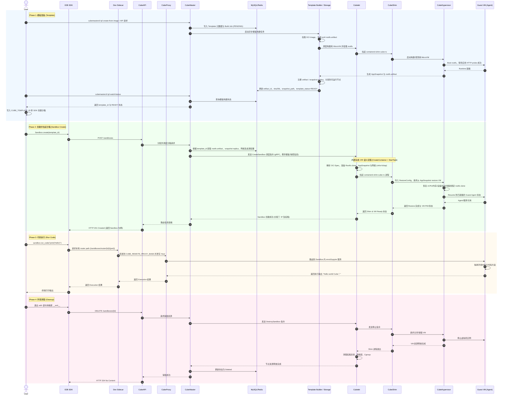

# CubeSandbox L1 架构设计与交互图 (基于 SDK Demo)

## 1. 概述 (Overview)
本文档基于 `e2b-dev-sidecar` 的 User Story，描述从模板构建、模板就绪、Python SDK 创建 Sandbox、代码执行到最终销毁的全生命周期 L1 级别核心组件架构与交互流程。

CubeSandbox 兼容了 OCI 标准与 CRI 语义，但在具体实现上（如 Cubelet）进行了大量合并与性能优化，将原本繁琐的容器拉起过程封装为极速的轻量级微隔离 VM 启动。

## 2. 核心组件拓扑 (Component Topology)

系统主要由以下组件构成：

*   **E2B SDK (User Client)**：用户编写的脚本程序（如 `demo.py`），提供高层的 `Sandbox.create()` 和 `run_code()` 接口。
*   **Dev Sidecar**：开发调试组件，仅代理 SDK 的数据面访问。它把 envd、Jupyter、文件、MCP 和沙箱端口请求改写到本地 router path，再转发到 CubeProxy。
*   **CubeAPI**：控制面 REST API 网关（默认端口 3000），负责接收 `Sandbox.create()`、`DELETE /sandboxes/{id}` 等生命周期请求。
*   **CubeProxy**：数据面反向代理，解析 `<port>-<sandbox_id>.<domain>` 形式的 Host 头，将 SDK 数据面请求路由到目标 Sandbox。
*   **CubeMaster**：中央控制面板，负责集群资源调度、Sandbox 生命周期管理，以及 Template（沙箱模板）的管理。依赖 MySQL/Redis 存储元数据。
*   **Template Builder / Storage**：模板构建与分发链路，从 OCI 镜像生成 rootfs artifact，启动一次构建用 MicroVM 完成探测与 AppSnapshot，并把可复用的模板产物注册、分发到可调度节点。
*   **Cubelet**：部署在宿主机的 Node Agent。它内置了精简版的 containerd 库逻辑，作为单机沙箱实例的直接管理者，接管了传统的 CRI `RunPodSandbox`、`CreateContainer`、`StartContainer` 流程。
*   **CubeShim (containerd-shim-cube-rs)**：CubeSandbox 深度定制的 Shim 进程，实现 containerd Shim v2 接口，负责把 Sandbox 生命周期接入运行时并管理与虚拟化层的交互。
*   **CubeHypervisor**：基于 Cloud Hypervisor / KVM 的 MicroVM 管理层，负责真正创建和驱动 Guest VM。
*   **Guest VM (Sandbox)**：基于模板镜像拉起的极速微虚拟机，内部运行着支撑代码执行的 Agent 和环境。

---

## 3. 核心业务流交互图 (Sequence Diagram)




---

## 4. 阶段详细说明

### 4.1 Phase 1: 模板准备 (Template)
Template 是 Sandbox 的基础镜像与运行时配置快照。它不是每次 `Sandbox.create()` 时临时构建，而是提前通过异步流水线生成，最终变成可以被 `template_id` 引用的不可变产物。完整链路可以理解为：

```text
OCI Image -> ext4 rootfs -> 构建用 MicroVM Boot/Probe -> AppSnapshot -> Artifact/Snapshot 注册分发 -> Template READY
```

1. **提交模板构建请求**：用户通过 `cubemastercli tpl create-from-image` 或等价 API 提交 OCI 镜像、可写层大小、暴露端口、环境变量、健康检查端口与路径等配置。CubeMaster 写入模板元数据和构建 Job，立即返回 `job_id` 与预生成的 `template_id`，此时模板通常仍处于 `PENDING` / `PULLING` / `BUILDING` 等中间状态。
2. **生成 rootfs artifact**：模板构建任务拉取 OCI 镜像，将镜像层解包并转换为 Sandbox 运行时可挂载的 rootfs 产物，例如 ext4 rootfs。这个阶段会记录 artifact 元数据、规格指纹和镜像摘要，便于后续复用与一致性校验。
3. **Boot 与探测**：Cube 会启动一次构建/探测用 MicroVM，把 rootfs 挂进去，让系统服务、语言运行时和用户进程真正启动。模板创建命令里的 `--expose-port`、`--probe`、`--probe-path` 用于判断应用何时就绪；探测成功后才适合把当前状态作为后续 Sandbox 的启动基线。
4. **AppSnapshot 与注册**：运行时就绪后，构建链路生成可复用的 AppSnapshot，同时保留 rootfs artifact。AppSnapshot 记录的是后续可以 restore 的 VM 运行状态，rootfs artifact 则提供可克隆的文件系统基底。系统会将 `artifact_id`、`artifact_sha256`、`template_spec_fingerprint`、snapshot 路径/版本等信息写回元数据存储，并把产物注册为模板。
5. **分发与 READY**：在多节点场景中，模板产物需要分发到可调度节点，包括 rootfs artifact 和 AppSnapshot replica。只有当模板状态进入 `READY`，并且目标节点具备对应 artifact/snapshot 后，后续 `Sandbox.create(template=...)` 才能稳定、快速地从该模板恢复 MicroVM。
6. **SDK 消费模板**：`e2b-dev-sidecar` 示例从这里开始接入：用户把 READY 模板的 `template_id` 填入 `CUBE_TEMPLATE_ID`，`demo.py` 读取后调用 `Sandbox.create(template=template_id)`。也就是说，demo 不创建模板，但完整系统链路中模板准备是 Sandbox 生命周期的上游基础。

### 4.2 Phase 2: 创建并拉起沙箱 (Sandbox Create)
1. **控制面直连**：SDK 层调用 `Sandbox.create()` 后，直接向 `E2B_API_URL` 指向的 `CubeAPI` 投递 HTTP POST 请求；Dev Sidecar 不代理控制面请求。
2. **中心调度**：`CubeMaster` 获取到模板数据后，负责寻找可用的宿主机（Node）。调度时不仅看资源余量，也要确保目标节点具备该模板的 rootfs artifact 与 AppSnapshot replica，或者能在创建前完成拉取/准备。
3. **节点准备**：`Cubelet` 收到请求后，**并没有**去调用系统守护进程中的 `containerd`，而是利用其自身编译链接的 `containerd` 库：
    * 组装 OCI Spec，注入模板 rootfs、AppSnapshot restore、kernel/image path 等运行时注解。
    * 从模板 rootfs artifact 准备本次 Sandbox 独占的 rootfs clone / writable layer，避免污染模板基底。
    * 准备网络（netfile、tap、virtio-fs 等）和 cgroup 资源。
    * 将原本需要经过多重调用的 CRI 生命周期（Sandbox -> Container -> Task）封装在单次工作流中。
    * 直接拉起父进程为 `Cubelet` 的 `containerd-shim-cube-rs`。
4. **快照恢复启动**：`containerd-shim-cube-rs` 作为 Shim 管理运行时生命周期，并调用 CubeHypervisor 的 restore 路径从 AppSnapshot 恢复 VM。这个过程不是重新从零 boot Guest OS，而是恢复 vCPU、内存、设备状态，并把本次 Sandbox 的 rootfs clone 重新绑定到恢复后的 VM，使 Guest Agent 和应用服务尽快回到模板探测成功时的就绪状态。
5. **兜底路径**：如果模板没有可用 AppSnapshot，或目标节点的 snapshot replica 缺失/损坏，系统需要退回到较慢的普通启动路径：准备 rootfs 后冷启动 MicroVM，等待 Guest Agent 与应用服务重新初始化。这条路径正确但慢，不是快启动的主路径。

### 4.3 Phase 3: 代码执行 (Run Code)
与标准容器捕获 `PID 1` stdout 不同，高层 SDK 执行代码并非依赖于捕获初始进程的输出流（默认情况下，为了性能，VM `/init` 的原生输出会被定向至 `cio.NullIO` 丢弃）。
相反，用户的代码片段作为 Payload，通过 SDK 的 envd/Jupyter 数据面请求发送给 Sandbox 内已经准备就绪的执行服务。在 `e2b-dev-sidecar` 模式下，这类数据面请求会先被 SDK helper 改写到本地 Dev Sidecar，再由 Sidecar 转发到 `CUBE_REMOTE_PROXY_BASE` 指向的 CubeProxy，并改写 Host 头为 `<port>-<sandbox_id>.<sandbox-domain>`。CubeProxy 根据 Host 将请求路由到目标 Sandbox，执行完毕后结果沿原路返回。

### 4.4 Phase 4: 环境清理 (Cleanup)
SDK 生命周期的 `__exit__` 钩子会主动向 CubeAPI 发出销毁请求。`Cubelet` 负责通知 `containerd-shim-cube-rs` 退出，Shim 再协调 CubeHypervisor 释放 VM 占用的资源，并同时进行清理收尾工作：
* 解除 `virtio-fs` 或 `overlayfs` 的目录挂载点。
* 清理网络 Tap 设备及相应的 Cgroup 资源组。
* 更新 `CubeMaster` 数据库中的沙箱存活状态。
